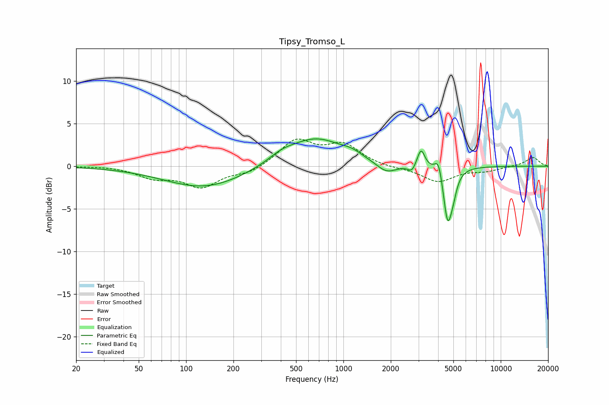

# Tipsy_Tromso_L
See [usage instructions](https://github.com/jaakkopasanen/AutoEq#usage) for more options and info.

### Parametric EQs
Apply preamp of -3.3 dB when using parametric equalizer.

|   # | Type    |   Fc (Hz) |    Q |   Gain (dB) |
|-----|---------|-----------|------|-------------|
|   1 | Peaking |       131 | 0.56 |        -2.5 |
|   2 | Peaking |       403 | 1.7  |         0.7 |
|   3 | Peaking |       664 | 0.79 |         3.3 |
|   4 | Peaking |      1135 | 2.23 |         0.5 |
|   5 | Peaking |      1882 | 2.18 |        -1.2 |
|   6 | Peaking |      2721 | 6    |        -0.8 |
|   7 | Peaking |      3115 | 6    |         2.2 |
|   8 | Peaking |      4028 | 6    |         2   |
|   9 | Peaking |      4601 | 5.05 |        -6.4 |
|  10 | Peaking |      5002 | 6    |        -1.4 |

### Fixed Band EQs
When using fixed band (also called graphic) equalizer, apply preamp of **-3.3 dB** (if available) and set gains manually with these parameters.

|   # | Type    |   Fc (Hz) |    Q |   Gain (dB) |
|-----|---------|-----------|------|-------------|
|   1 | Peaking |        31 | 1.41 |         0.1 |
|   2 | Peaking |        62 | 1.41 |        -1.2 |
|   3 | Peaking |       125 | 1.41 |        -2.3 |
|   4 | Peaking |       250 | 1.41 |        -0.8 |
|   5 | Peaking |       500 | 1.41 |         3   |
|   6 | Peaking |      1000 | 1.41 |         2.4 |
|   7 | Peaking |      2000 | 1.41 |        -0.2 |
|   8 | Peaking |      4000 | 1.41 |        -1.8 |
|   9 | Peaking |      8000 | 1.41 |        -0.5 |
|  10 | Peaking |     16000 | 1.41 |         1.1 |

### Graphs

