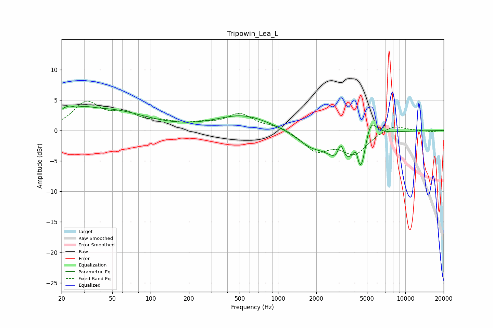

# Tripowin_Lea_L
See [usage instructions](https://github.com/jaakkopasanen/AutoEq#usage) for more options and info.

### Parametric EQs
Apply preamp of -4.1 dB when using parametric equalizer.

|   # | Type    |   Fc (Hz) |    Q |   Gain (dB) |
|-----|---------|-----------|------|-------------|
|   1 | Peaking |        24 | 1.55 |         3.5 |
|   2 | Peaking |        26 | 2.86 |        -1.5 |
|   3 | Peaking |        50 | 0.51 |         3   |
|   4 | Peaking |       531 | 0.67 |         2.5 |
|   5 | Peaking |      1819 | 1.28 |        -2.2 |
|   6 | Peaking |      3115 | 6    |         3.2 |
|   7 | Peaking |      3146 | 1.53 |        -4.8 |
|   8 | Peaking |      4105 | 6    |         2.8 |
|   9 | Peaking |      4440 | 3.53 |        -6.5 |
|  10 | Peaking |      5314 | 2.99 |         3.8 |

### Fixed Band EQs
When using fixed band (also called graphic) equalizer, apply preamp of **-4.9 dB** (if available) and set gains manually with these parameters.

|   # | Type    |   Fc (Hz) |    Q |   Gain (dB) |
|-----|---------|-----------|------|-------------|
|   1 | Peaking |        31 | 1.41 |         4.4 |
|   2 | Peaking |        62 | 1.41 |         2.3 |
|   3 | Peaking |       125 | 1.41 |         1.1 |
|   4 | Peaking |       250 | 1.41 |         0.8 |
|   5 | Peaking |       500 | 1.41 |         2.6 |
|   6 | Peaking |      1000 | 1.41 |         0.8 |
|   7 | Peaking |      2000 | 1.41 |        -3.2 |
|   8 | Peaking |      4000 | 1.41 |        -3.6 |
|   9 | Peaking |      8000 | 1.41 |         1.1 |
|  10 | Peaking |     16000 | 1.41 |        -0.2 |

### Graphs

