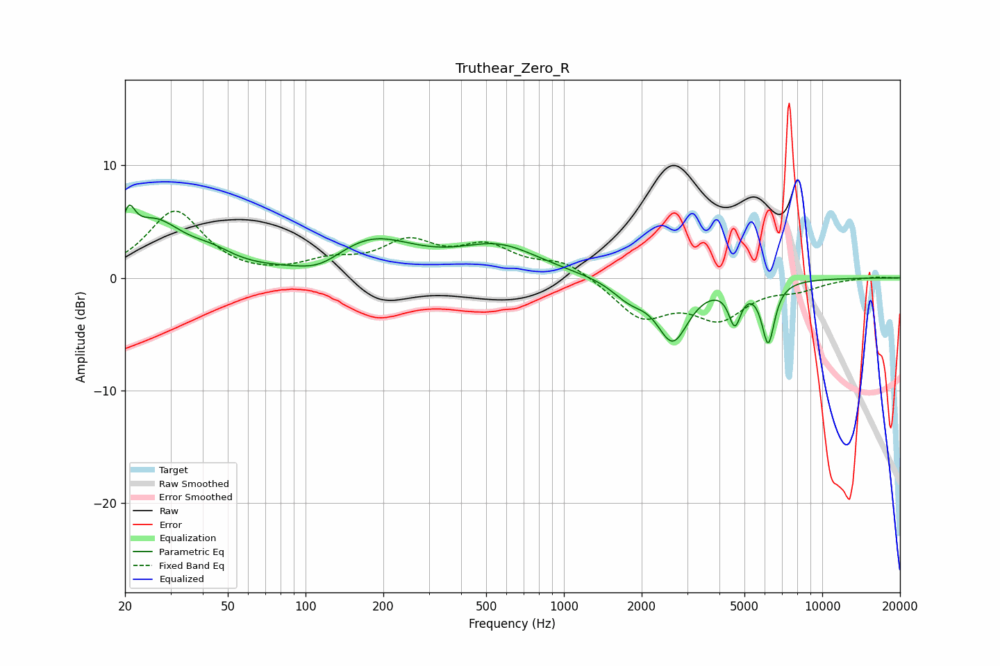

# Truthear_Zero_R
See [usage instructions](https://github.com/jaakkopasanen/AutoEq#usage) for more options and info.

### Parametric EQs
Apply preamp of -6.6 dB when using parametric equalizer.

|   # | Type    |   Fc (Hz) |    Q |   Gain (dB) |
|-----|---------|-----------|------|-------------|
|   1 | Peaking |        21 | 5.94 |         2.8 |
|   2 | Peaking |        26 | 1.25 |         4.6 |
|   3 | Peaking |        43 | 1.6  |         1.1 |
|   4 | Peaking |       114 | 1.54 |        -1.2 |
|   5 | Peaking |       178 | 0.83 |         3.4 |
|   6 | Peaking |       563 | 0.9  |         2.6 |
|   7 | Peaking |      1788 | 2.1  |        -1.5 |
|   8 | Peaking |      2639 | 2.29 |        -5.3 |
|   9 | Peaking |      4587 | 5.96 |        -3.3 |
|  10 | Peaking |      6179 | 5.53 |        -5.4 |

### Fixed Band EQs
When using fixed band (also called graphic) equalizer, apply preamp of **-6.0 dB** (if available) and set gains manually with these parameters.

|   # | Type    |   Fc (Hz) |    Q |   Gain (dB) |
|-----|---------|-----------|------|-------------|
|   1 | Peaking |        31 | 1.41 |         5.9 |
|   2 | Peaking |        62 | 1.41 |        -0.1 |
|   3 | Peaking |       125 | 1.41 |         1.2 |
|   4 | Peaking |       250 | 1.41 |         2.8 |
|   5 | Peaking |       500 | 1.41 |         2.5 |
|   6 | Peaking |      1000 | 1.41 |         1.4 |
|   7 | Peaking |      2000 | 1.41 |        -3.4 |
|   8 | Peaking |      4000 | 1.41 |        -3.3 |
|   9 | Peaking |      8000 | 1.41 |        -0.8 |
|  10 | Peaking |     16000 | 1.41 |         0.1 |

### Graphs

