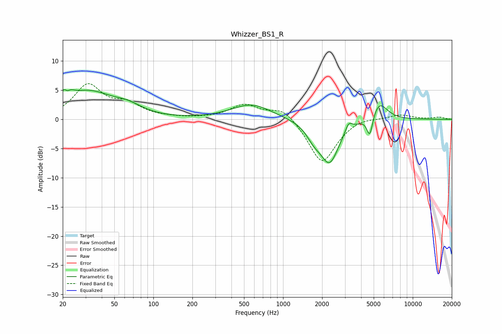

# Whizzer_BS1_R
See [usage instructions](https://github.com/jaakkopasanen/AutoEq#usage) for more options and info.

### Parametric EQs
Apply preamp of -5.2 dB when using parametric equalizer.

|   # | Type    |   Fc (Hz) |    Q |   Gain (dB) |
|-----|---------|-----------|------|-------------|
|   1 | Peaking |        21 | 4.05 |         4.6 |
|   2 | Peaking |        22 | 5.99 |        -2.9 |
|   3 | Peaking |        32 | 0.8  |         4.4 |
|   4 | Peaking |        63 | 1.26 |         1.4 |
|   5 | Peaking |       570 | 0.93 |         2.6 |
|   6 | Peaking |      1726 | 2.49 |        -1.9 |
|   7 | Peaking |      2283 | 1.92 |        -7.2 |
|   8 | Peaking |      3204 | 5.54 |         1.6 |
|   9 | Peaking |      4665 | 6    |        -3.8 |
|  10 | Peaking |      5480 | 2.22 |         3.3 |

### Fixed Band EQs
When using fixed band (also called graphic) equalizer, apply preamp of **-6.2 dB** (if available) and set gains manually with these parameters.

|   # | Type    |   Fc (Hz) |    Q |   Gain (dB) |
|-----|---------|-----------|------|-------------|
|   1 | Peaking |        31 | 1.41 |         5.7 |
|   2 | Peaking |        62 | 1.41 |         2.2 |
|   3 | Peaking |       125 | 1.41 |         0.2 |
|   4 | Peaking |       250 | 1.41 |         0.1 |
|   5 | Peaking |       500 | 1.41 |         2.4 |
|   6 | Peaking |      1000 | 1.41 |         2.2 |
|   7 | Peaking |      2000 | 1.41 |        -7.6 |
|   8 | Peaking |      4000 | 1.41 |         0.6 |
|   9 | Peaking |      8000 | 1.41 |         0.8 |
|  10 | Peaking |     16000 | 1.41 |         0.4 |

### Graphs

