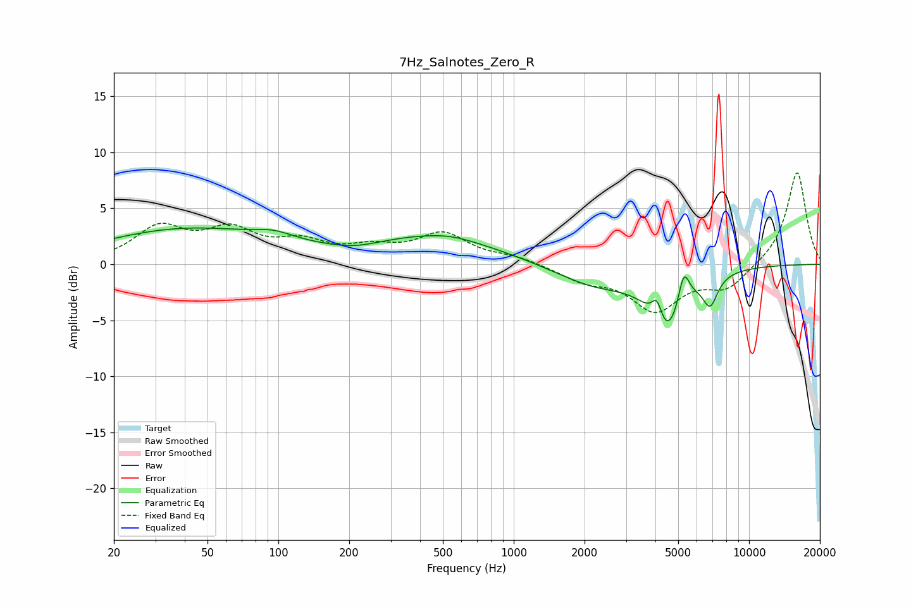

# 7Hz_Salnotes_Zero_R
See [usage instructions](https://github.com/jaakkopasanen/AutoEq#usage) for more options and info.

### Parametric EQs
Apply preamp of -3.3 dB when using parametric equalizer.

|   # | Type    |   Fc (Hz) |    Q |   Gain (dB) |
|-----|---------|-----------|------|-------------|
|   1 | Peaking |        41 | 0.38 |         3.1 |
|   2 | Peaking |        96 | 1.63 |         0.7 |
|   3 | Peaking |       211 | 1.4  |        -0.5 |
|   4 | Peaking |       460 | 0.49 |         2.4 |
|   5 | Peaking |       538 | 1.55 |         0.2 |
|   6 | Peaking |      2231 | 0.8  |        -1.9 |
|   7 | Peaking |      4067 | 6    |         2.3 |
|   8 | Peaking |      4450 | 1.99 |        -5.8 |
|   9 | Peaking |      5280 | 5.82 |         3.1 |
|  10 | Peaking |      6838 | 4.34 |        -2.6 |

### Fixed Band EQs
When using fixed band (also called graphic) equalizer, apply preamp of **-8.3 dB** (if available) and set gains manually with these parameters.

|   # | Type    |   Fc (Hz) |    Q |   Gain (dB) |
|-----|---------|-----------|------|-------------|
|   1 | Peaking |        31 | 1.41 |         3.1 |
|   2 | Peaking |        62 | 1.41 |         2.7 |
|   3 | Peaking |       125 | 1.41 |         1.7 |
|   4 | Peaking |       250 | 1.41 |         1.2 |
|   5 | Peaking |       500 | 1.41 |         2.6 |
|   6 | Peaking |      1000 | 1.41 |         0.6 |
|   7 | Peaking |      2000 | 1.41 |        -1.3 |
|   8 | Peaking |      4000 | 1.41 |        -3.9 |
|   9 | Peaking |      8000 | 1.41 |        -2.1 |
|  10 | Peaking |     16000 | 1.41 |         8.4 |

### Graphs

