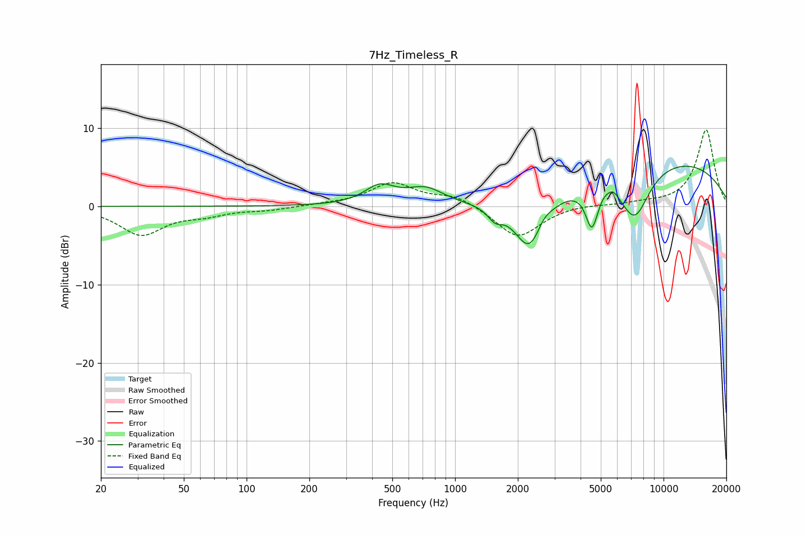

# 7Hz_Timeless_R
See [usage instructions](https://github.com/jaakkopasanen/AutoEq#usage) for more options and info.

### Parametric EQs
Apply preamp of -5.2 dB when using parametric equalizer.

|   # | Type    |   Fc (Hz) |    Q |   Gain (dB) |
|-----|---------|-----------|------|-------------|
|   1 | Peaking |       435 | 1.96 |         2.3 |
|   2 | Peaking |       719 | 1.58 |         2   |
|   3 | Peaking |      1555 | 4.13 |        -1.4 |
|   4 | Peaking |      2285 | 1.93 |        -7   |
|   5 | Peaking |      2647 | 3.72 |         1.3 |
|   6 | Peaking |      4530 | 4.69 |        -5.2 |
|   7 | Peaking |      5177 | 5.95 |         0.3 |
|   8 | Peaking |      5732 | 5.44 |         0.9 |
|   9 | Peaking |      7269 | 1.86 |        -6.5 |
|  10 | Peaking |     10000 | 0.28 |         6   |

### Fixed Band EQs
When using fixed band (also called graphic) equalizer, apply preamp of **-9.9 dB** (if available) and set gains manually with these parameters.

|   # | Type    |   Fc (Hz) |    Q |   Gain (dB) |
|-----|---------|-----------|------|-------------|
|   1 | Peaking |        31 | 1.41 |        -3.6 |
|   2 | Peaking |        62 | 1.41 |        -0.9 |
|   3 | Peaking |       125 | 1.41 |        -0.4 |
|   4 | Peaking |       250 | 1.41 |         0.2 |
|   5 | Peaking |       500 | 1.41 |         2.9 |
|   6 | Peaking |      1000 | 1.41 |         1.3 |
|   7 | Peaking |      2000 | 1.41 |        -4.1 |
|   8 | Peaking |      4000 | 1.41 |         0.3 |
|   9 | Peaking |      8000 | 1.41 |         0.3 |
|  10 | Peaking |     16000 | 1.41 |         9.8 |

### Graphs

