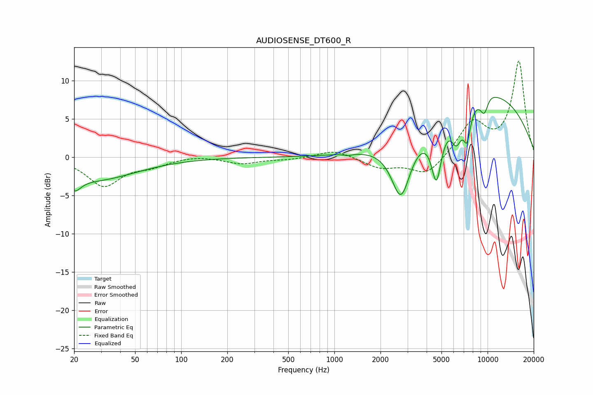

# AUDIOSENSE_DT600_R
See [usage instructions](https://github.com/jaakkopasanen/AutoEq#usage) for more options and info.

### Parametric EQs
Apply preamp of -7.9 dB when using parametric equalizer.

|   # | Type    |   Fc (Hz) |    Q |   Gain (dB) |
|-----|---------|-----------|------|-------------|
|   1 | Peaking |        20 | 3.47 |        -1.7 |
|   2 | Peaking |        27 | 0.52 |        -2.9 |
|   3 | Peaking |      1225 | 5.56 |        -0.2 |
|   4 | Peaking |      2722 | 2.2  |        -7.9 |
|   5 | Peaking |      4637 | 4.08 |        -7.3 |
|   6 | Peaking |      6272 | 3.81 |        -3.8 |
|   7 | Peaking |      7340 | 5.51 |        -4.1 |
|   8 | Peaking |      9521 | 0.31 |         8.5 |
|   9 | Peaking |      9527 | 4.42 |        -2.7 |
|  10 | Peaking |      9916 | 2.79 |         0.9 |

### Fixed Band EQs
When using fixed band (also called graphic) equalizer, apply preamp of **-12.7 dB** (if available) and set gains manually with these parameters.

|   # | Type    |   Fc (Hz) |    Q |   Gain (dB) |
|-----|---------|-----------|------|-------------|
|   1 | Peaking |        31 | 1.41 |        -3.7 |
|   2 | Peaking |        62 | 1.41 |        -0.9 |
|   3 | Peaking |       125 | 1.41 |         0.3 |
|   4 | Peaking |       250 | 1.41 |        -0.8 |
|   5 | Peaking |       500 | 1.41 |        -0.3 |
|   6 | Peaking |      1000 | 1.41 |         1   |
|   7 | Peaking |      2000 | 1.41 |        -1.3 |
|   8 | Peaking |      4000 | 1.41 |        -2.4 |
|   9 | Peaking |      8000 | 1.41 |         4.4 |
|  10 | Peaking |     16000 | 1.41 |        12.5 |

### Graphs

