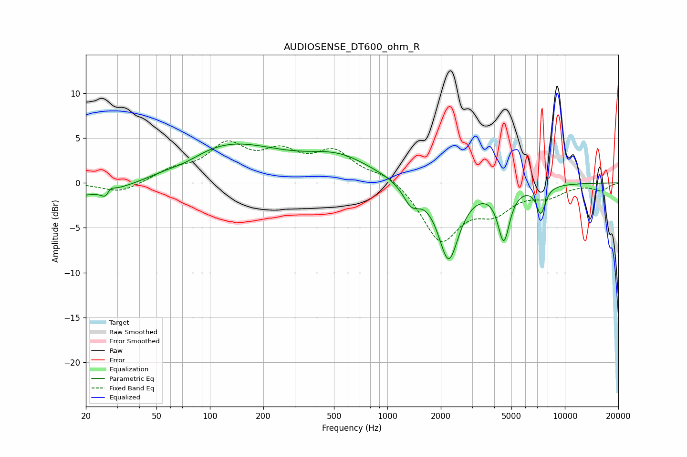

# AUDIOSENSE_DT600_ohm_R
See [usage instructions](https://github.com/jaakkopasanen/AutoEq#usage) for more options and info.

### Parametric EQs
Apply preamp of -4.4 dB when using parametric equalizer.

|   # | Type    |   Fc (Hz) |    Q |   Gain (dB) |
|-----|---------|-----------|------|-------------|
|   1 | Peaking |        20 | 0.31 |        -1.9 |
|   2 | Peaking |        26 | 5.96 |        -2   |
|   3 | Peaking |        27 | 6    |         1.7 |
|   4 | Peaking |        74 | 1.45 |        -0.6 |
|   5 | Peaking |       120 | 0.45 |         4.6 |
|   6 | Peaking |       535 | 0.76 |         2.5 |
|   7 | Peaking |      1365 | 3    |        -2.2 |
|   8 | Peaking |      2213 | 2.39 |        -8.4 |
|   9 | Peaking |      4527 | 4.25 |        -5.8 |
|  10 | Peaking |      7321 | 5.17 |        -3   |

### Fixed Band EQs
When using fixed band (also called graphic) equalizer, apply preamp of **-4.8 dB** (if available) and set gains manually with these parameters.

|   # | Type    |   Fc (Hz) |    Q |   Gain (dB) |
|-----|---------|-----------|------|-------------|
|   1 | Peaking |        31 | 1.41 |        -1.2 |
|   2 | Peaking |        62 | 1.41 |         1.2 |
|   3 | Peaking |       125 | 1.41 |         3.9 |
|   4 | Peaking |       250 | 1.41 |         2.8 |
|   5 | Peaking |       500 | 1.41 |         3.2 |
|   6 | Peaking |      1000 | 1.41 |         1.2 |
|   7 | Peaking |      2000 | 1.41 |        -6.4 |
|   8 | Peaking |      4000 | 1.41 |        -2.7 |
|   9 | Peaking |      8000 | 1.41 |        -1.3 |
|  10 | Peaking |     16000 | 1.41 |        -0.8 |

### Graphs

