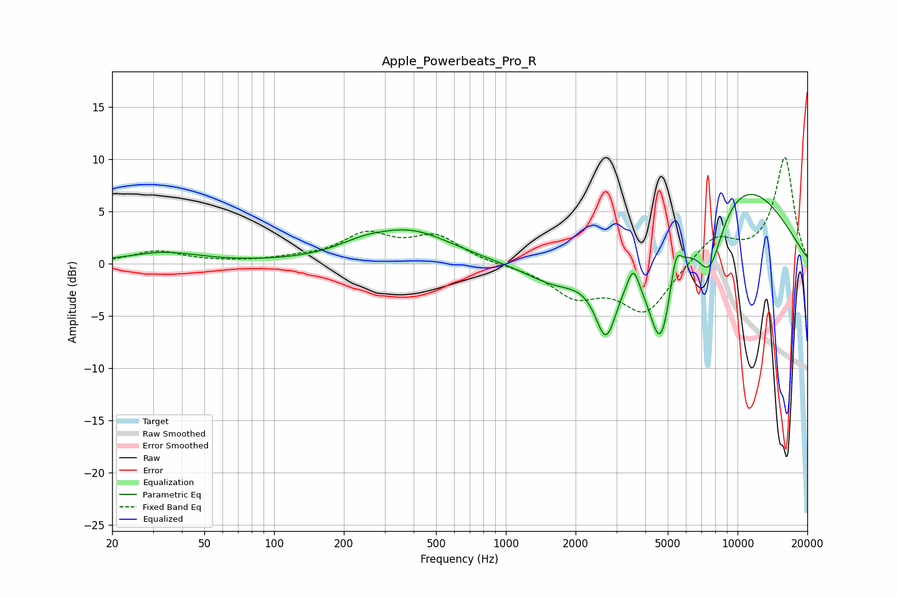

# Apple_Powerbeats_Pro_R
See [usage instructions](https://github.com/jaakkopasanen/AutoEq#usage) for more options and info.

### Parametric EQs
Apply preamp of -6.7 dB when using parametric equalizer.

|   # | Type    |   Fc (Hz) |    Q |   Gain (dB) |
|-----|---------|-----------|------|-------------|
|   1 | Peaking |        33 | 0.92 |         1   |
|   2 | Peaking |       238 | 1.33 |         0.7 |
|   3 | Peaking |       386 | 0.77 |         3   |
|   4 | Peaking |      1651 | 1.03 |        -2.2 |
|   5 | Peaking |      2709 | 2.89 |        -6.7 |
|   6 | Peaking |      3547 | 6    |         2.1 |
|   7 | Peaking |      4655 | 2.47 |       -10.2 |
|   8 | Peaking |      5418 | 6    |         3   |
|   9 | Peaking |      7572 | 2.2  |        -6.3 |
|  10 | Peaking |      9711 | 0.45 |         8.2 |

### Fixed Band EQs
When using fixed band (also called graphic) equalizer, apply preamp of **-10.2 dB** (if available) and set gains manually with these parameters.

|   # | Type    |   Fc (Hz) |    Q |   Gain (dB) |
|-----|---------|-----------|------|-------------|
|   1 | Peaking |        31 | 1.41 |         1.2 |
|   2 | Peaking |        62 | 1.41 |         0.1 |
|   3 | Peaking |       125 | 1.41 |         0.4 |
|   4 | Peaking |       250 | 1.41 |         2.6 |
|   5 | Peaking |       500 | 1.41 |         2.5 |
|   6 | Peaking |      1000 | 1.41 |        -0.2 |
|   7 | Peaking |      2000 | 1.41 |        -2.8 |
|   8 | Peaking |      4000 | 1.41 |        -4.6 |
|   9 | Peaking |      8000 | 1.41 |         2.6 |
|  10 | Peaking |     16000 | 1.41 |        10.1 |

### Graphs

