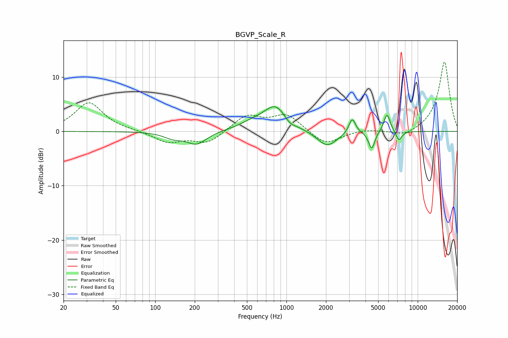

# BGVP_Scale_R
See [usage instructions](https://github.com/jaakkopasanen/AutoEq#usage) for more options and info.

### Parametric EQs
Apply preamp of -4.6 dB when using parametric equalizer.

|   # | Type    |   Fc (Hz) |    Q |   Gain (dB) |
|-----|---------|-----------|------|-------------|
|   1 | Peaking |       137 | 1.98 |        -1   |
|   2 | Peaking |       207 | 1.84 |        -2.3 |
|   3 | Peaking |       554 | 1.29 |         1.2 |
|   4 | Peaking |       827 | 1.62 |         4.4 |
|   5 | Peaking |      1057 | 3.32 |        -0.9 |
|   6 | Peaking |      2042 | 1.86 |        -2.9 |
|   7 | Peaking |      3171 | 5.6  |         2.9 |
|   8 | Peaking |      4463 | 6    |        -3.3 |
|   9 | Peaking |      5835 | 5.63 |         3.4 |
|  10 | Peaking |      7193 | 6    |        -1.8 |

### Fixed Band EQs
When using fixed band (also called graphic) equalizer, apply preamp of **-12.9 dB** (if available) and set gains manually with these parameters.

|   # | Type    |   Fc (Hz) |    Q |   Gain (dB) |
|-----|---------|-----------|------|-------------|
|   1 | Peaking |        31 | 1.41 |         5.3 |
|   2 | Peaking |        62 | 1.41 |         0.1 |
|   3 | Peaking |       125 | 1.41 |        -2   |
|   4 | Peaking |       250 | 1.41 |        -2.2 |
|   5 | Peaking |       500 | 1.41 |         2.9 |
|   6 | Peaking |      1000 | 1.41 |         3   |
|   7 | Peaking |      2000 | 1.41 |        -2.6 |
|   8 | Peaking |      4000 | 1.41 |         0.4 |
|   9 | Peaking |      8000 | 1.41 |        -1.1 |
|  10 | Peaking |     16000 | 1.41 |        12.9 |

### Graphs

