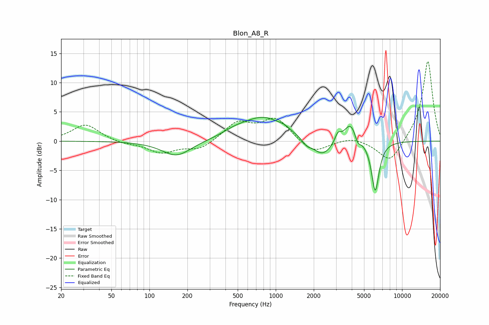

# Blon_A8_R
See [usage instructions](https://github.com/jaakkopasanen/AutoEq#usage) for more options and info.

### Parametric EQs
Apply preamp of -4.2 dB when using parametric equalizer.

|   # | Type    |   Fc (Hz) |    Q |   Gain (dB) |
|-----|---------|-----------|------|-------------|
|   1 | Peaking |       164 | 1.24 |        -2.6 |
|   2 | Peaking |       473 | 1.37 |         0.9 |
|   3 | Peaking |       797 | 0.89 |         3.9 |
|   4 | Peaking |      1175 | 2.63 |         0.6 |
|   5 | Peaking |      1760 | 4.24 |        -0.8 |
|   6 | Peaking |      2346 | 1.76 |        -2.9 |
|   7 | Peaking |      3101 | 6    |         1.5 |
|   8 | Peaking |      3918 | 2.67 |         3.6 |
|   9 | Peaking |      4457 | 6    |        -1.5 |
|  10 | Peaking |      6132 | 4.48 |        -8.7 |

### Fixed Band EQs
When using fixed band (also called graphic) equalizer, apply preamp of **-13.7 dB** (if available) and set gains manually with these parameters.

|   # | Type    |   Fc (Hz) |    Q |   Gain (dB) |
|-----|---------|-----------|------|-------------|
|   1 | Peaking |        31 | 1.41 |         2.9 |
|   2 | Peaking |        62 | 1.41 |        -0.5 |
|   3 | Peaking |       125 | 1.41 |        -1.9 |
|   4 | Peaking |       250 | 1.41 |        -1.5 |
|   5 | Peaking |       500 | 1.41 |         3.1 |
|   6 | Peaking |      1000 | 1.41 |         3.8 |
|   7 | Peaking |      2000 | 1.41 |        -2.2 |
|   8 | Peaking |      4000 | 1.41 |         0.7 |
|   9 | Peaking |      8000 | 1.41 |        -3.9 |
|  10 | Peaking |     16000 | 1.41 |        13.9 |

### Graphs

