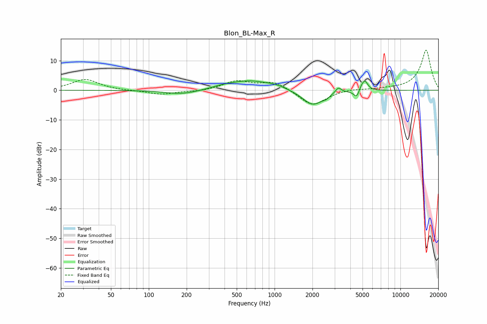

# Blon_BL-Max_R
See [usage instructions](https://github.com/jaakkopasanen/AutoEq#usage) for more options and info.

### Parametric EQs
Apply preamp of -3.3 dB when using parametric equalizer.

|   # | Type    |   Fc (Hz) |    Q |   Gain (dB) |
|-----|---------|-----------|------|-------------|
|   1 | Peaking |       184 | 1.08 |        -1.5 |
|   2 | Peaking |       376 | 2.06 |         0.4 |
|   3 | Peaking |       621 | 0.83 |         3.2 |
|   4 | Peaking |      1029 | 1.79 |         0.8 |
|   5 | Peaking |      2010 | 1.7  |        -5.2 |
|   6 | Peaking |      2576 | 6    |        -0.7 |
|   7 | Peaking |      3210 | 6    |         2   |
|   8 | Peaking |      4494 | 6    |        -2.7 |
|   9 | Peaking |      4899 | 6    |         1.4 |
|  10 | Peaking |      5229 | 5.97 |         3   |

### Fixed Band EQs
When using fixed band (also called graphic) equalizer, apply preamp of **-13.6 dB** (if available) and set gains manually with these parameters.

|   # | Type    |   Fc (Hz) |    Q |   Gain (dB) |
|-----|---------|-----------|------|-------------|
|   1 | Peaking |        31 | 1.41 |         3.7 |
|   2 | Peaking |        62 | 1.41 |        -0.1 |
|   3 | Peaking |       125 | 1.41 |        -1.4 |
|   4 | Peaking |       250 | 1.41 |        -0.4 |
|   5 | Peaking |       500 | 1.41 |         3   |
|   6 | Peaking |      1000 | 1.41 |         2.9 |
|   7 | Peaking |      2000 | 1.41 |        -5.4 |
|   8 | Peaking |      4000 | 1.41 |         0.6 |
|   9 | Peaking |      8000 | 1.41 |         0.3 |
|  10 | Peaking |     16000 | 1.41 |        13.6 |

### Graphs

