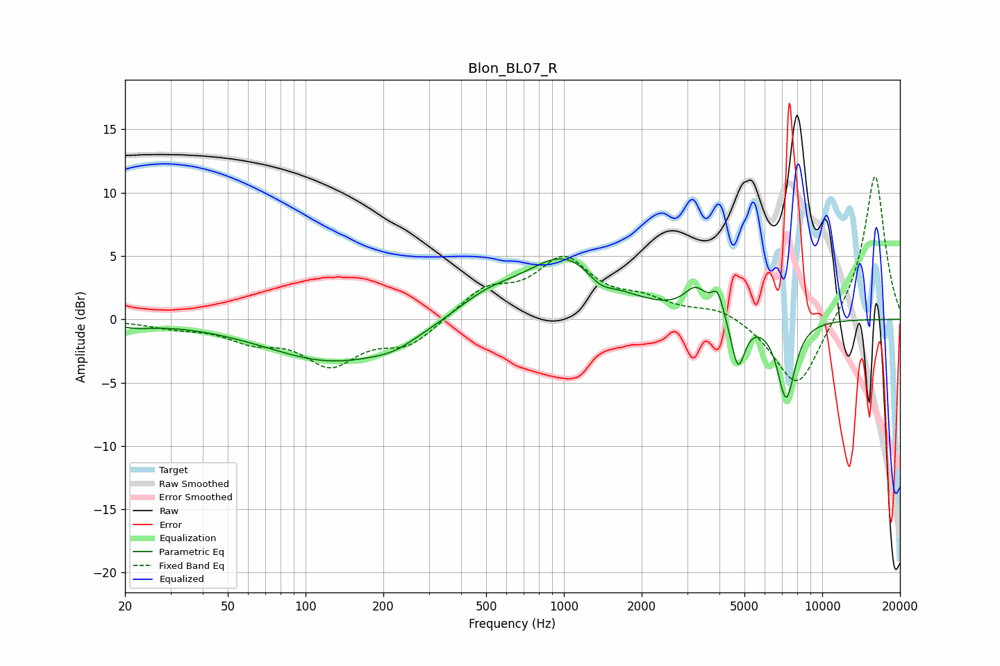

# Blon_BL07_R
See [usage instructions](https://github.com/jaakkopasanen/AutoEq#usage) for more options and info.

### Parametric EQs
Apply preamp of -4.9 dB when using parametric equalizer.

|   # | Type    |   Fc (Hz) |    Q |   Gain (dB) |
|-----|---------|-----------|------|-------------|
|   1 | Peaking |        22 | 1.92 |        -0.4 |
|   2 | Peaking |       130 | 0.53 |        -3.3 |
|   3 | Peaking |       221 | 1.64 |        -0.6 |
|   4 | Peaking |       495 | 1.16 |         1.4 |
|   5 | Peaking |      1013 | 0.86 |         4.8 |
|   6 | Peaking |      1380 | 2.76 |        -1   |
|   7 | Peaking |      3238 | 3.17 |         1.9 |
|   8 | Peaking |      3939 | 6    |         1.9 |
|   9 | Peaking |      4719 | 5.24 |        -4   |
|  10 | Peaking |      7252 | 3.91 |        -6.2 |

### Fixed Band EQs
When using fixed band (also called graphic) equalizer, apply preamp of **-11.4 dB** (if available) and set gains manually with these parameters.

|   # | Type    |   Fc (Hz) |    Q |   Gain (dB) |
|-----|---------|-----------|------|-------------|
|   1 | Peaking |        31 | 1.41 |        -0.5 |
|   2 | Peaking |        62 | 1.41 |        -1.4 |
|   3 | Peaking |       125 | 1.41 |        -3.3 |
|   4 | Peaking |       250 | 1.41 |        -2   |
|   5 | Peaking |       500 | 1.41 |         2.2 |
|   6 | Peaking |      1000 | 1.41 |         4.4 |
|   7 | Peaking |      2000 | 1.41 |         1.2 |
|   8 | Peaking |      4000 | 1.41 |         0.9 |
|   9 | Peaking |      8000 | 1.41 |        -5.8 |
|  10 | Peaking |     16000 | 1.41 |        11.6 |

### Graphs

