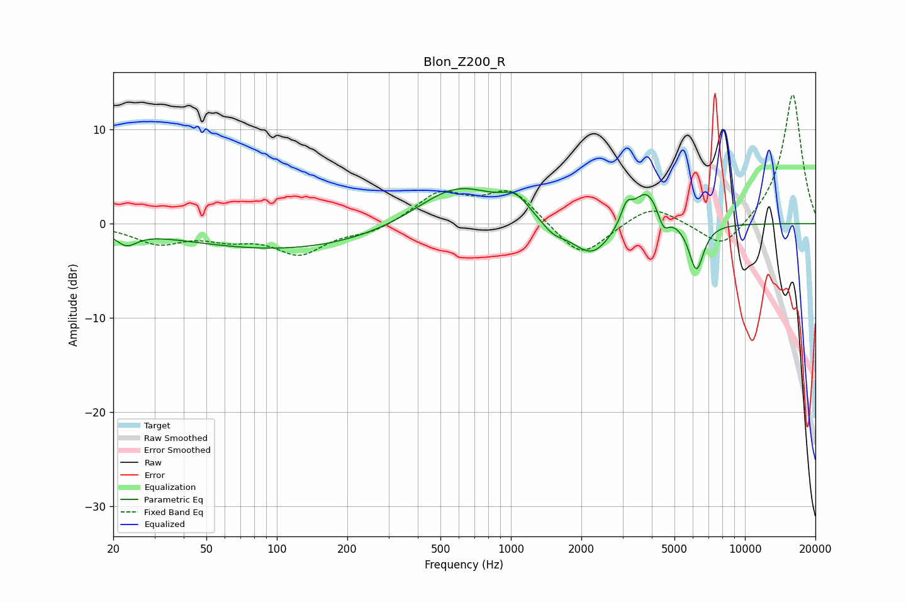

# Blon_Z200_R
See [usage instructions](https://github.com/jaakkopasanen/AutoEq#usage) for more options and info.

### Parametric EQs
Apply preamp of -3.8 dB when using parametric equalizer.

|   # | Type    |   Fc (Hz) |    Q |   Gain (dB) |
|-----|---------|-----------|------|-------------|
|   1 | Peaking |        23 | 3.13 |        -1.5 |
|   2 | Peaking |       111 | 0.31 |        -2.8 |
|   3 | Peaking |       588 | 0.81 |         4.4 |
|   4 | Peaking |      1046 | 2.41 |         1.8 |
|   5 | Peaking |      1520 | 2.64 |        -1.2 |
|   6 | Peaking |      2219 | 1.66 |        -3.7 |
|   7 | Peaking |      3121 | 6    |         1.9 |
|   8 | Peaking |      3802 | 2.43 |         4   |
|   9 | Peaking |      4483 | 5.99 |        -1.8 |
|  10 | Peaking |      6200 | 4.35 |        -5.1 |

### Fixed Band EQs
When using fixed band (also called graphic) equalizer, apply preamp of **-13.8 dB** (if available) and set gains manually with these parameters.

|   # | Type    |   Fc (Hz) |    Q |   Gain (dB) |
|-----|---------|-----------|------|-------------|
|   1 | Peaking |        31 | 1.41 |        -1.9 |
|   2 | Peaking |        62 | 1.41 |        -1.3 |
|   3 | Peaking |       125 | 1.41 |        -3   |
|   4 | Peaking |       250 | 1.41 |        -0.9 |
|   5 | Peaking |       500 | 1.41 |         3.2 |
|   6 | Peaking |      1000 | 1.41 |         3.5 |
|   7 | Peaking |      2000 | 1.41 |        -3.8 |
|   8 | Peaking |      4000 | 1.41 |         2.1 |
|   9 | Peaking |      8000 | 1.41 |        -3   |
|  10 | Peaking |     16000 | 1.41 |        13.9 |

### Graphs

