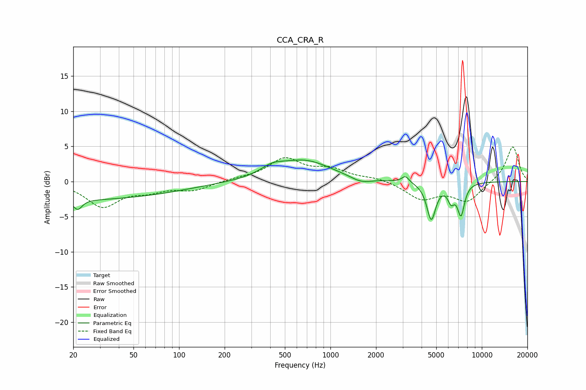

# CCA_CRA_R
See [usage instructions](https://github.com/jaakkopasanen/AutoEq#usage) for more options and info.

### Parametric EQs
Apply preamp of -3.2 dB when using parametric equalizer.

|   # | Type    |   Fc (Hz) |    Q |   Gain (dB) |
|-----|---------|-----------|------|-------------|
|   1 | Peaking |        20 | 0.19 |        -2.6 |
|   2 | Peaking |        21 | 5.11 |        -1.4 |
|   3 | Peaking |       411 | 1.9  |         1.1 |
|   4 | Peaking |       672 | 0.79 |         2.9 |
|   5 | Peaking |      1596 | 2.06 |        -0.8 |
|   6 | Peaking |      3128 | 6    |         0.9 |
|   7 | Peaking |      4638 | 4.72 |        -5.6 |
|   8 | Peaking |      4694 | 5.99 |         0.3 |
|   9 | Peaking |      6269 | 6    |        -2.1 |
|  10 | Peaking |      7282 | 5.7  |        -4.4 |

### Fixed Band EQs
When using fixed band (also called graphic) equalizer, apply preamp of **-5.0 dB** (if available) and set gains manually with these parameters.

|   # | Type    |   Fc (Hz) |    Q |   Gain (dB) |
|-----|---------|-----------|------|-------------|
|   1 | Peaking |        31 | 1.41 |        -3.5 |
|   2 | Peaking |        62 | 1.41 |        -1.1 |
|   3 | Peaking |       125 | 1.41 |        -1.2 |
|   4 | Peaking |       250 | 1.41 |         0.3 |
|   5 | Peaking |       500 | 1.41 |         3.1 |
|   6 | Peaking |      1000 | 1.41 |         1.5 |
|   7 | Peaking |      2000 | 1.41 |         0.5 |
|   8 | Peaking |      4000 | 1.41 |        -2.4 |
|   9 | Peaking |      8000 | 1.41 |        -2.8 |
|  10 | Peaking |     16000 | 1.41 |         5.1 |

### Graphs

