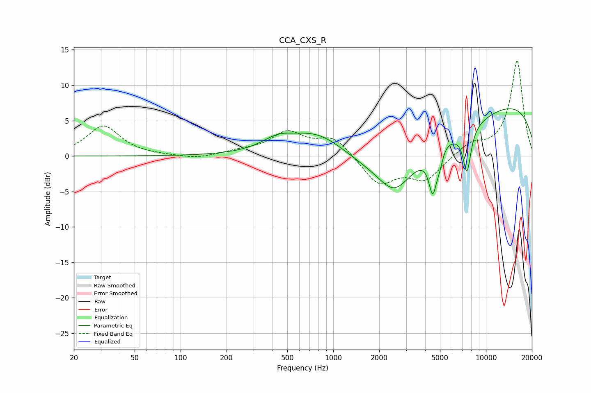

# CCA_CXS_R
See [usage instructions](https://github.com/jaakkopasanen/AutoEq#usage) for more options and info.

### Parametric EQs
Apply preamp of -6.8 dB when using parametric equalizer.

|   # | Type    |   Fc (Hz) |    Q |   Gain (dB) |
|-----|---------|-----------|------|-------------|
|   1 | Peaking |       418 | 1.45 |         1.2 |
|   2 | Peaking |       465 | 2    |         0.2 |
|   3 | Peaking |       791 | 0.7  |         4.3 |
|   4 | Peaking |      2516 | 1.34 |        -4.3 |
|   5 | Peaking |      3291 | 0.31 |        -5.7 |
|   6 | Peaking |      4486 | 5.37 |        -5.6 |
|   7 | Peaking |      4978 | 5.82 |        -1.9 |
|   8 | Peaking |      5242 | 3.15 |         0.9 |
|   9 | Peaking |      7514 | 5.12 |        -6.1 |
|  10 | Peaking |     10000 | 0.2  |         8.5 |

### Fixed Band EQs
When using fixed band (also called graphic) equalizer, apply preamp of **-13.5 dB** (if available) and set gains manually with these parameters.

|   # | Type    |   Fc (Hz) |    Q |   Gain (dB) |
|-----|---------|-----------|------|-------------|
|   1 | Peaking |        31 | 1.41 |         4.2 |
|   2 | Peaking |        62 | 1.41 |         0   |
|   3 | Peaking |       125 | 1.41 |        -0.5 |
|   4 | Peaking |       250 | 1.41 |         0.6 |
|   5 | Peaking |       500 | 1.41 |         3.2 |
|   6 | Peaking |      1000 | 1.41 |         2.6 |
|   7 | Peaking |      2000 | 1.41 |        -4   |
|   8 | Peaking |      4000 | 1.41 |        -3.3 |
|   9 | Peaking |      8000 | 1.41 |         1.6 |
|  10 | Peaking |     16000 | 1.41 |        13.5 |

### Graphs

