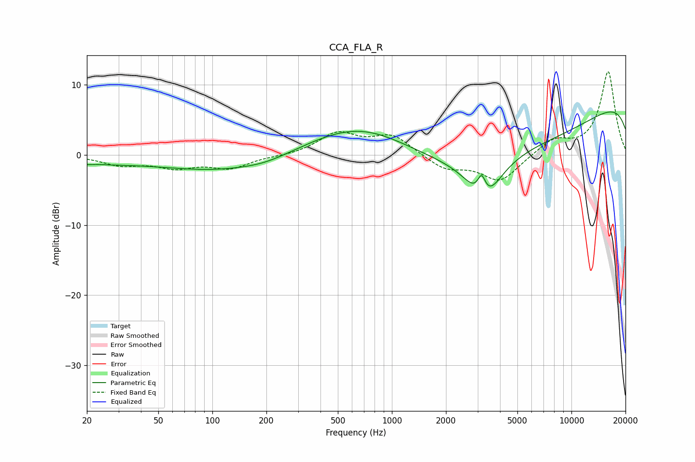

# CCA_FLA_R
See [usage instructions](https://github.com/jaakkopasanen/AutoEq#usage) for more options and info.

### Parametric EQs
Apply preamp of -6.2 dB when using parametric equalizer.

|   # | Type    |   Fc (Hz) |    Q |   Gain (dB) |
|-----|---------|-----------|------|-------------|
|   1 | Peaking |        20 | 5.44 |        -0.2 |
|   2 | Peaking |        23 | 0.67 |        -0.8 |
|   3 | Peaking |       124 | 0.39 |        -2.4 |
|   4 | Peaking |       200 | 1.19 |        -0.4 |
|   5 | Peaking |       702 | 0.46 |         6.2 |
|   6 | Peaking |      2312 | 0.37 |         1.4 |
|   7 | Peaking |      3160 | 5.98 |         3.2 |
|   8 | Peaking |      3246 | 1.57 |        -6.6 |
|   9 | Peaking |      4447 | 0.2  |       -10.8 |
|  10 | Peaking |     10000 | 0.18 |        12.2 |

### Fixed Band EQs
When using fixed band (also called graphic) equalizer, apply preamp of **-12.0 dB** (if available) and set gains manually with these parameters.

|   # | Type    |   Fc (Hz) |    Q |   Gain (dB) |
|-----|---------|-----------|------|-------------|
|   1 | Peaking |        31 | 1.41 |        -1.3 |
|   2 | Peaking |        62 | 1.41 |        -1.6 |
|   3 | Peaking |       125 | 1.41 |        -1.8 |
|   4 | Peaking |       250 | 1.41 |        -0.2 |
|   5 | Peaking |       500 | 1.41 |         3   |
|   6 | Peaking |      1000 | 1.41 |         2.7 |
|   7 | Peaking |      2000 | 1.41 |        -2   |
|   8 | Peaking |      4000 | 1.41 |        -3.8 |
|   9 | Peaking |      8000 | 1.41 |         2.1 |
|  10 | Peaking |     16000 | 1.41 |        11.9 |

### Graphs

