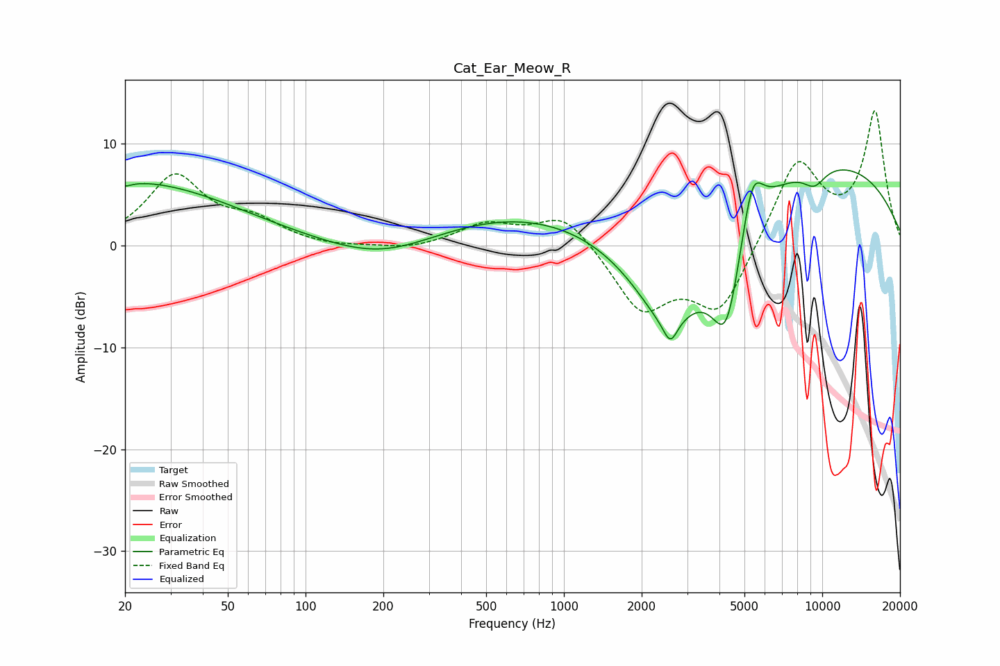

# Cat_Ear_Meow_R
See [usage instructions](https://github.com/jaakkopasanen/AutoEq#usage) for more options and info.

### Parametric EQs
Apply preamp of -7.5 dB when using parametric equalizer.

|   # | Type    |   Fc (Hz) |    Q |   Gain (dB) |
|-----|---------|-----------|------|-------------|
|   1 | Peaking |        20 | 5.79 |        -0.3 |
|   2 | Peaking |        22 | 0.36 |         6.2 |
|   3 | Peaking |       199 | 0.67 |        -2.2 |
|   4 | Peaking |       828 | 0.33 |         3.7 |
|   5 | Peaking |      2510 | 0.84 |       -12.2 |
|   6 | Peaking |      2584 | 5.37 |        -2.1 |
|   7 | Peaking |      4257 | 2.12 |       -10.7 |
|   8 | Peaking |      5350 | 3.18 |         6   |
|   9 | Peaking |      8748 | 0.25 |         8.9 |
|  10 | Peaking |      9321 | 2.82 |        -1.7 |

### Fixed Band EQs
When using fixed band (also called graphic) equalizer, apply preamp of **-13.3 dB** (if available) and set gains manually with these parameters.

|   # | Type    |   Fc (Hz) |    Q |   Gain (dB) |
|-----|---------|-----------|------|-------------|
|   1 | Peaking |        31 | 1.41 |         6.7 |
|   2 | Peaking |        62 | 1.41 |         2.1 |
|   3 | Peaking |       125 | 1.41 |        -0.3 |
|   4 | Peaking |       250 | 1.41 |        -0.5 |
|   5 | Peaking |       500 | 1.41 |         2   |
|   6 | Peaking |      1000 | 1.41 |         3.3 |
|   7 | Peaking |      2000 | 1.41 |        -6.2 |
|   8 | Peaking |      4000 | 1.41 |        -6.6 |
|   9 | Peaking |      8000 | 1.41 |         8.5 |
|  10 | Peaking |     16000 | 1.41 |        12.9 |

### Graphs

