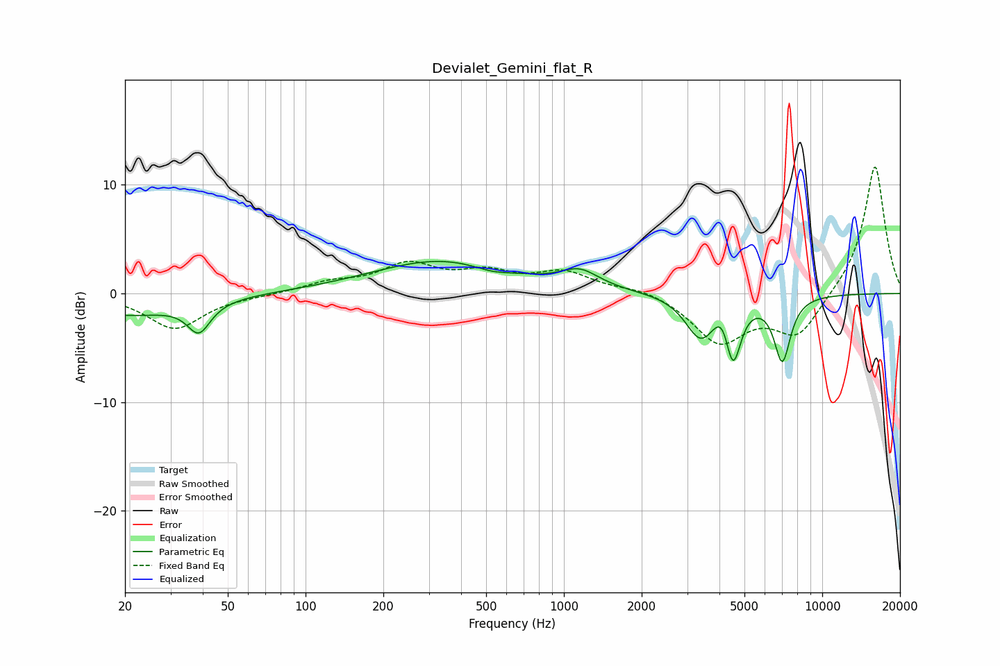

# Devialet_Gemini_flat_R
See [usage instructions](https://github.com/jaakkopasanen/AutoEq#usage) for more options and info.

### Parametric EQs
Apply preamp of -3.0 dB when using parametric equalizer.

|   # | Type    |   Fc (Hz) |    Q |   Gain (dB) |
|-----|---------|-----------|------|-------------|
|   1 | Peaking |        20 | 0.64 |        -1.9 |
|   2 | Peaking |        39 | 3.26 |        -2.7 |
|   3 | Peaking |       345 | 0.52 |         3.1 |
|   4 | Peaking |       523 | 1.96 |        -0.5 |
|   5 | Peaking |       554 | 0.97 |        -0.2 |
|   6 | Peaking |      1152 | 1.92 |         1.6 |
|   7 | Peaking |      3383 | 2.4  |        -3.9 |
|   8 | Peaking |      4120 | 4.32 |         1.8 |
|   9 | Peaking |      4513 | 4.63 |        -5.7 |
|  10 | Peaking |      7006 | 4.26 |        -5.9 |

### Fixed Band EQs
When using fixed band (also called graphic) equalizer, apply preamp of **-11.7 dB** (if available) and set gains manually with these parameters.

|   # | Type    |   Fc (Hz) |    Q |   Gain (dB) |
|-----|---------|-----------|------|-------------|
|   1 | Peaking |        31 | 1.41 |        -3.2 |
|   2 | Peaking |        62 | 1.41 |        -0.1 |
|   3 | Peaking |       125 | 1.41 |         0.9 |
|   4 | Peaking |       250 | 1.41 |         2.5 |
|   5 | Peaking |       500 | 1.41 |         1.6 |
|   6 | Peaking |      1000 | 1.41 |         1.8 |
|   7 | Peaking |      2000 | 1.41 |         0.6 |
|   8 | Peaking |      4000 | 1.41 |        -4.4 |
|   9 | Peaking |      8000 | 1.41 |        -3.9 |
|  10 | Peaking |     16000 | 1.41 |        12   |

### Graphs

