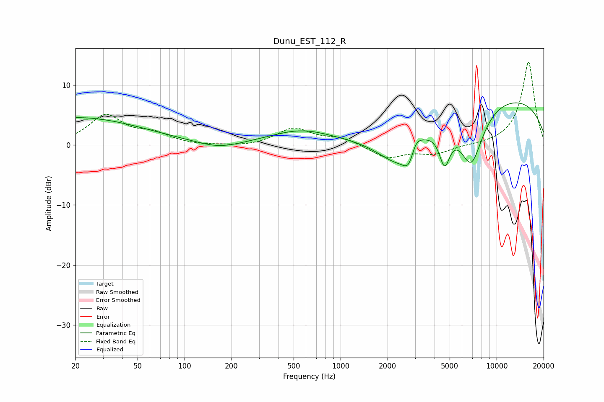

# Dunu_EST_112_R
See [usage instructions](https://github.com/jaakkopasanen/AutoEq#usage) for more options and info.

### Parametric EQs
Apply preamp of -7.1 dB when using parametric equalizer.

|   # | Type    |   Fc (Hz) |    Q |   Gain (dB) |
|-----|---------|-----------|------|-------------|
|   1 | Peaking |        20 | 0.33 |         4.6 |
|   2 | Peaking |       166 | 1.08 |        -1.1 |
|   3 | Peaking |       556 | 0.72 |         2.3 |
|   4 | Peaking |      2323 | 1.02 |        -6   |
|   5 | Peaking |      2763 | 3.58 |        -3.9 |
|   6 | Peaking |      2994 | 3.55 |         3   |
|   7 | Peaking |      4640 | 4.01 |        -5.9 |
|   8 | Peaking |      6880 | 1.72 |        -9.9 |
|   9 | Peaking |      9573 | 0.22 |         8.4 |
|  10 | Peaking |     10000 | 5.67 |         0   |

### Fixed Band EQs
When using fixed band (also called graphic) equalizer, apply preamp of **-13.9 dB** (if available) and set gains manually with these parameters.

|   # | Type    |   Fc (Hz) |    Q |   Gain (dB) |
|-----|---------|-----------|------|-------------|
|   1 | Peaking |        31 | 1.41 |         4.8 |
|   2 | Peaking |        62 | 1.41 |         1.6 |
|   3 | Peaking |       125 | 1.41 |        -0.2 |
|   4 | Peaking |       250 | 1.41 |        -0.3 |
|   5 | Peaking |       500 | 1.41 |         2.7 |
|   6 | Peaking |      1000 | 1.41 |         1.2 |
|   7 | Peaking |      2000 | 1.41 |        -2.2 |
|   8 | Peaking |      4000 | 1.41 |        -1.4 |
|   9 | Peaking |      8000 | 1.41 |        -0.1 |
|  10 | Peaking |     16000 | 1.41 |        13.9 |

### Graphs

