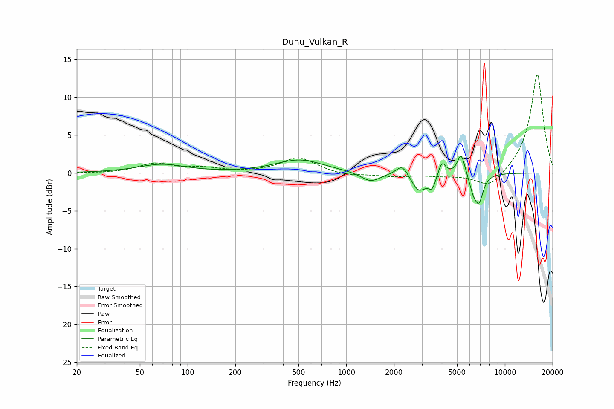

# Dunu_Vulkan_R
See [usage instructions](https://github.com/jaakkopasanen/AutoEq#usage) for more options and info.

### Parametric EQs
Apply preamp of -2.3 dB when using parametric equalizer.

|   # | Type    |   Fc (Hz) |    Q |   Gain (dB) |
|-----|---------|-----------|------|-------------|
|   1 | Peaking |        69 | 0.96 |         1.1 |
|   2 | Peaking |       508 | 0.94 |         1.7 |
|   3 | Peaking |      1425 | 2.3  |        -1.3 |
|   4 | Peaking |      2257 | 3.75 |         1.5 |
|   5 | Peaking |      2866 | 2.99 |        -2.4 |
|   6 | Peaking |      3486 | 6    |        -1.7 |
|   7 | Peaking |      4010 | 5.99 |         1.9 |
|   8 | Peaking |      5304 | 5.89 |         2.9 |
|   9 | Peaking |      6298 | 6    |        -1.6 |
|  10 | Peaking |      6862 | 5.01 |        -3.5 |

### Fixed Band EQs
When using fixed band (also called graphic) equalizer, apply preamp of **-13.1 dB** (if available) and set gains manually with these parameters.

|   # | Type    |   Fc (Hz) |    Q |   Gain (dB) |
|-----|---------|-----------|------|-------------|
|   1 | Peaking |        31 | 1.41 |        -0.1 |
|   2 | Peaking |        62 | 1.41 |         1.2 |
|   3 | Peaking |       125 | 1.41 |         0.6 |
|   4 | Peaking |       250 | 1.41 |         0   |
|   5 | Peaking |       500 | 1.41 |         2   |
|   6 | Peaking |      1000 | 1.41 |        -0.4 |
|   7 | Peaking |      2000 | 1.41 |        -0.4 |
|   8 | Peaking |      4000 | 1.41 |        -0.3 |
|   9 | Peaking |      8000 | 1.41 |        -2.2 |
|  10 | Peaking |     16000 | 1.41 |        13.2 |

### Graphs

