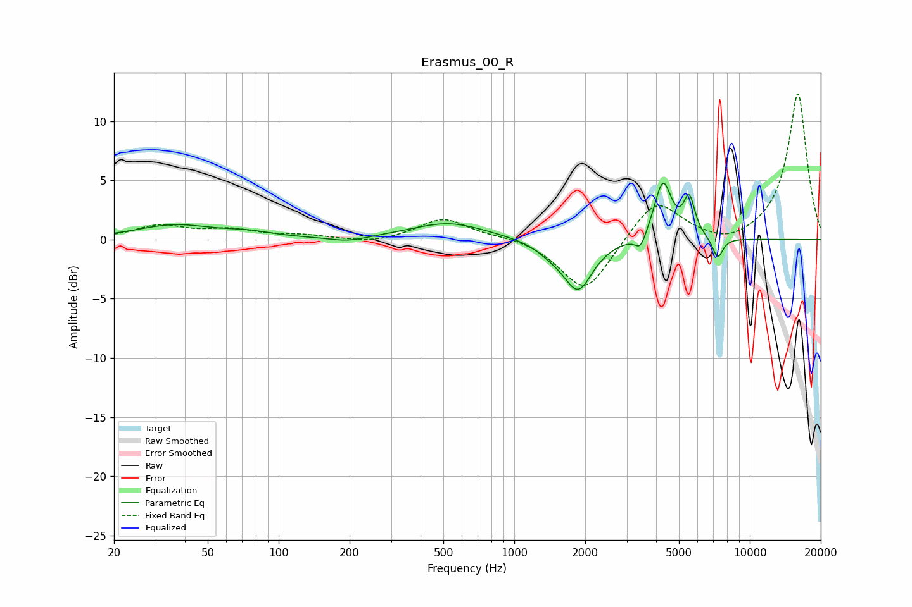

# Erasmus_00_R
See [usage instructions](https://github.com/jaakkopasanen/AutoEq#usage) for more options and info.

### Parametric EQs
Apply preamp of -4.9 dB when using parametric equalizer.

|   # | Type    |   Fc (Hz) |    Q |   Gain (dB) |
|-----|---------|-----------|------|-------------|
|   1 | Peaking |        36 | 0.9  |         1.2 |
|   2 | Peaking |        74 | 1.37 |         0.4 |
|   3 | Peaking |       197 | 1.86 |        -0.4 |
|   4 | Peaking |       526 | 0.89 |         1.4 |
|   5 | Peaking |      1432 | 2.21 |        -0.7 |
|   6 | Peaking |      1866 | 2.3  |        -4.2 |
|   7 | Peaking |      3436 | 5.99 |        -1.3 |
|   8 | Peaking |      4273 | 3.85 |         4.9 |
|   9 | Peaking |      5530 | 5.81 |         3.2 |
|  10 | Peaking |      7300 | 6    |        -1.8 |

### Fixed Band EQs
When using fixed band (also called graphic) equalizer, apply preamp of **-12.4 dB** (if available) and set gains manually with these parameters.

|   # | Type    |   Fc (Hz) |    Q |   Gain (dB) |
|-----|---------|-----------|------|-------------|
|   1 | Peaking |        31 | 1.41 |         1.1 |
|   2 | Peaking |        62 | 1.41 |         0.7 |
|   3 | Peaking |       125 | 1.41 |         0.3 |
|   4 | Peaking |       250 | 1.41 |        -0.4 |
|   5 | Peaking |       500 | 1.41 |         1.8 |
|   6 | Peaking |      1000 | 1.41 |         0.3 |
|   7 | Peaking |      2000 | 1.41 |        -4.6 |
|   8 | Peaking |      4000 | 1.41 |         3.5 |
|   9 | Peaking |      8000 | 1.41 |        -0.7 |
|  10 | Peaking |     16000 | 1.41 |        12.4 |

### Graphs

