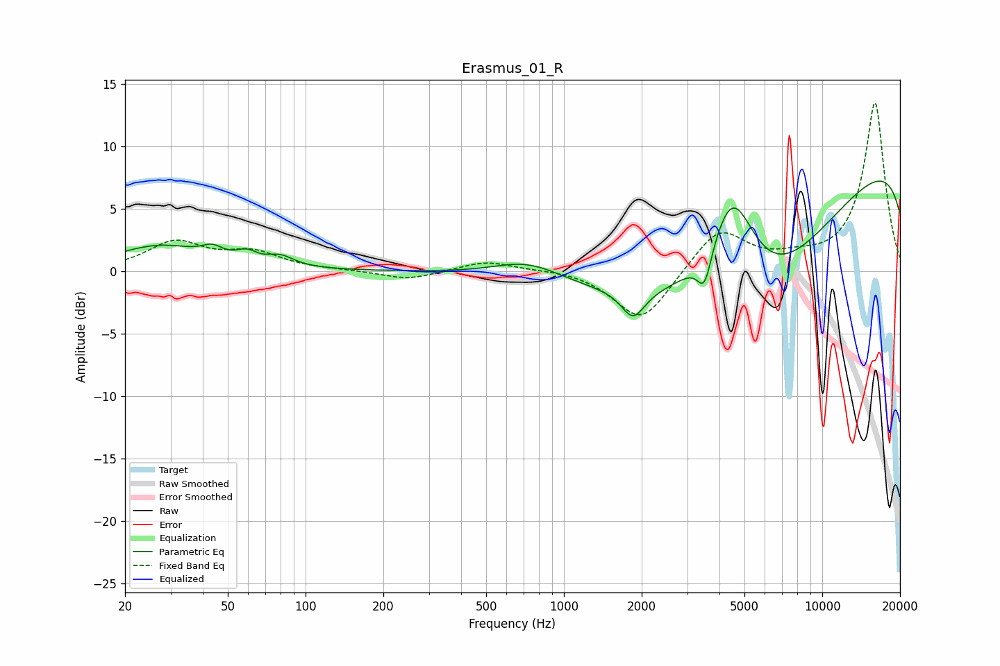

# Erasmus_01_R
See [usage instructions](https://github.com/jaakkopasanen/AutoEq#usage) for more options and info.

### Parametric EQs
Apply preamp of -7.3 dB when using parametric equalizer.

|   # | Type    |   Fc (Hz) |    Q |   Gain (dB) |
|-----|---------|-----------|------|-------------|
|   1 | Peaking |        27 | 0.83 |         2   |
|   2 | Peaking |        44 | 3.61 |         0.8 |
|   3 | Peaking |        59 | 3.64 |         0.8 |
|   4 | Peaking |        80 | 2.74 |         0.8 |
|   5 | Peaking |       728 | 1.04 |         1.6 |
|   6 | Peaking |      1853 | 3.16 |        -2.3 |
|   7 | Peaking |      3504 | 5.05 |        -2.9 |
|   8 | Peaking |      4488 | 1.41 |         9.5 |
|   9 | Peaking |      5527 | 0.32 |       -17   |
|  10 | Peaking |     10000 | 0.18 |        15.1 |

### Fixed Band EQs
When using fixed band (also called graphic) equalizer, apply preamp of **-13.6 dB** (if available) and set gains manually with these parameters.

|   # | Type    |   Fc (Hz) |    Q |   Gain (dB) |
|-----|---------|-----------|------|-------------|
|   1 | Peaking |        31 | 1.41 |         2.2 |
|   2 | Peaking |        62 | 1.41 |         1.3 |
|   3 | Peaking |       125 | 1.41 |         0   |
|   4 | Peaking |       250 | 1.41 |        -0.7 |
|   5 | Peaking |       500 | 1.41 |         0.8 |
|   6 | Peaking |      1000 | 1.41 |         0.2 |
|   7 | Peaking |      2000 | 1.41 |        -4.2 |
|   8 | Peaking |      4000 | 1.41 |         3.5 |
|   9 | Peaking |      8000 | 1.41 |         0.6 |
|  10 | Peaking |     16000 | 1.41 |        13.5 |

### Graphs

