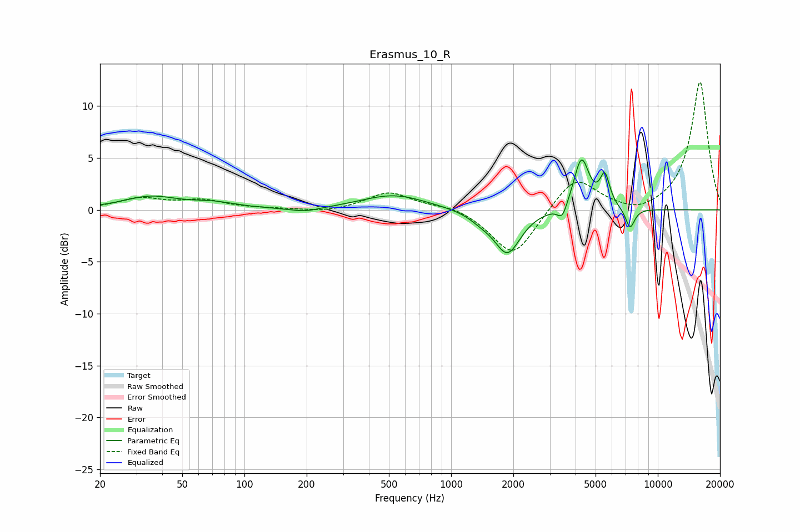

# Erasmus_10_R
See [usage instructions](https://github.com/jaakkopasanen/AutoEq#usage) for more options and info.

### Parametric EQs
Apply preamp of -4.9 dB when using parametric equalizer.

|   # | Type    |   Fc (Hz) |    Q |   Gain (dB) |
|-----|---------|-----------|------|-------------|
|   1 | Peaking |        35 | 1.08 |         1.2 |
|   2 | Peaking |        71 | 1.31 |         0.5 |
|   3 | Peaking |       197 | 1.89 |        -0.4 |
|   4 | Peaking |       529 | 0.9  |         1.4 |
|   5 | Peaking |      1401 | 2.3  |        -0.6 |
|   6 | Peaking |      1874 | 2.23 |        -4.1 |
|   7 | Peaking |      3451 | 6    |        -1.4 |
|   8 | Peaking |      4272 | 3.82 |         5   |
|   9 | Peaking |      5546 | 5.91 |         2.9 |
|  10 | Peaking |      7347 | 6    |        -2   |

### Fixed Band EQs
When using fixed band (also called graphic) equalizer, apply preamp of **-12.4 dB** (if available) and set gains manually with these parameters.

|   # | Type    |   Fc (Hz) |    Q |   Gain (dB) |
|-----|---------|-----------|------|-------------|
|   1 | Peaking |        31 | 1.41 |         1   |
|   2 | Peaking |        62 | 1.41 |         0.8 |
|   3 | Peaking |       125 | 1.41 |         0.1 |
|   4 | Peaking |       250 | 1.41 |        -0.3 |
|   5 | Peaking |       500 | 1.41 |         1.7 |
|   6 | Peaking |      1000 | 1.41 |         0.5 |
|   7 | Peaking |      2000 | 1.41 |        -4.6 |
|   8 | Peaking |      4000 | 1.41 |         3.3 |
|   9 | Peaking |      8000 | 1.41 |        -0.7 |
|  10 | Peaking |     16000 | 1.41 |        12.4 |

### Graphs

