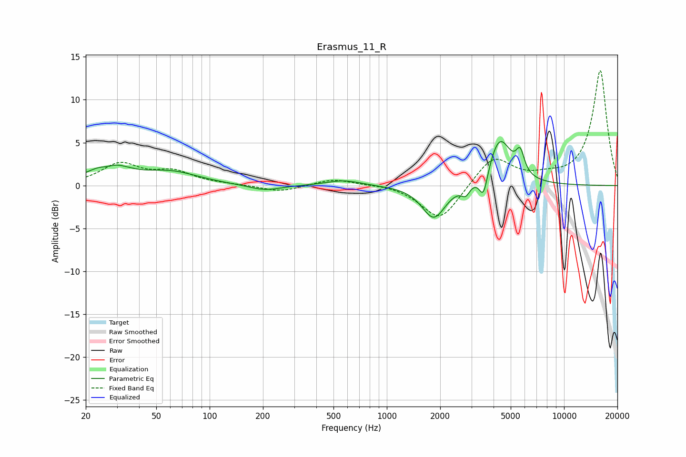

# Erasmus_11_R
See [usage instructions](https://github.com/jaakkopasanen/AutoEq#usage) for more options and info.

### Parametric EQs
Apply preamp of -5.2 dB when using parametric equalizer.

|   # | Type    |   Fc (Hz) |    Q |   Gain (dB) |
|-----|---------|-----------|------|-------------|
|   1 | Peaking |        26 | 3.5  |        -0.5 |
|   2 | Peaking |        27 | 1.34 |         2.4 |
|   3 | Peaking |        61 | 0.93 |         1.4 |
|   4 | Peaking |       205 | 1.55 |        -0.7 |
|   5 | Peaking |       571 | 1.44 |         0.6 |
|   6 | Peaking |      1842 | 2.13 |        -3.9 |
|   7 | Peaking |      2786 | 6    |        -1.1 |
|   8 | Peaking |      3513 | 5.86 |        -3.1 |
|   9 | Peaking |      4334 | 2.19 |         5.5 |
|  10 | Peaking |      5655 | 5.99 |         2.5 |

### Fixed Band EQs
When using fixed band (also called graphic) equalizer, apply preamp of **-13.5 dB** (if available) and set gains manually with these parameters.

|   # | Type    |   Fc (Hz) |    Q |   Gain (dB) |
|-----|---------|-----------|------|-------------|
|   1 | Peaking |        31 | 1.41 |         2.4 |
|   2 | Peaking |        62 | 1.41 |         1.5 |
|   3 | Peaking |       125 | 1.41 |         0.1 |
|   4 | Peaking |       250 | 1.41 |        -0.8 |
|   5 | Peaking |       500 | 1.41 |         0.8 |
|   6 | Peaking |      1000 | 1.41 |         0.2 |
|   7 | Peaking |      2000 | 1.41 |        -4.2 |
|   8 | Peaking |      4000 | 1.41 |         3.5 |
|   9 | Peaking |      8000 | 1.41 |         0.7 |
|  10 | Peaking |     16000 | 1.41 |        13.4 |

### Graphs

