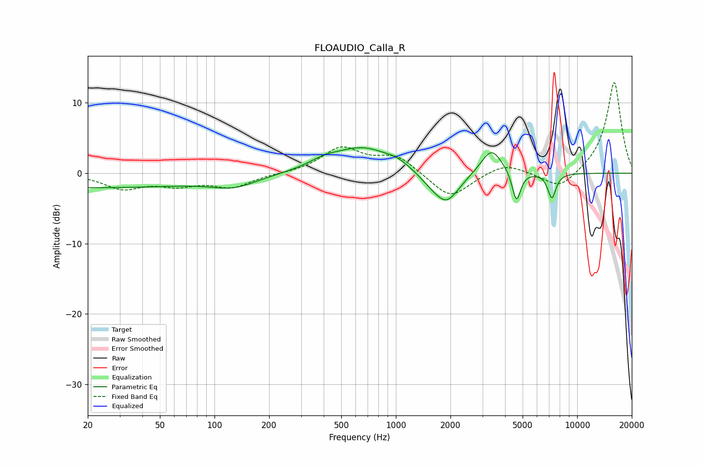

# FLOAUDIO_Calla_R
See [usage instructions](https://github.com/jaakkopasanen/AutoEq#usage) for more options and info.

### Parametric EQs
Apply preamp of -3.7 dB when using parametric equalizer.

|   # | Type    |   Fc (Hz) |    Q |   Gain (dB) |
|-----|---------|-----------|------|-------------|
|   1 | Peaking |        20 | 0.2  |        -2   |
|   2 | Peaking |       128 | 1.13 |        -1.5 |
|   3 | Peaking |       399 | 1.76 |         0.8 |
|   4 | Peaking |       655 | 0.86 |         3.6 |
|   5 | Peaking |      1013 | 2.44 |         0.6 |
|   6 | Peaking |      1528 | 2.36 |        -0.8 |
|   7 | Peaking |      1899 | 1.95 |        -4.4 |
|   8 | Peaking |      3368 | 2.42 |         3.7 |
|   9 | Peaking |      4622 | 6    |        -4.4 |
|  10 | Peaking |      7249 | 6    |        -3.5 |

### Fixed Band EQs
When using fixed band (also called graphic) equalizer, apply preamp of **-13.0 dB** (if available) and set gains manually with these parameters.

|   # | Type    |   Fc (Hz) |    Q |   Gain (dB) |
|-----|---------|-----------|------|-------------|
|   1 | Peaking |        31 | 1.41 |        -2.1 |
|   2 | Peaking |        62 | 1.41 |        -1.4 |
|   3 | Peaking |       125 | 1.41 |        -1.9 |
|   4 | Peaking |       250 | 1.41 |        -0   |
|   5 | Peaking |       500 | 1.41 |         3.5 |
|   6 | Peaking |      1000 | 1.41 |         2.4 |
|   7 | Peaking |      2000 | 1.41 |        -3.7 |
|   8 | Peaking |      4000 | 1.41 |         1.5 |
|   9 | Peaking |      8000 | 1.41 |        -2.5 |
|  10 | Peaking |     16000 | 1.41 |        13.1 |

### Graphs

