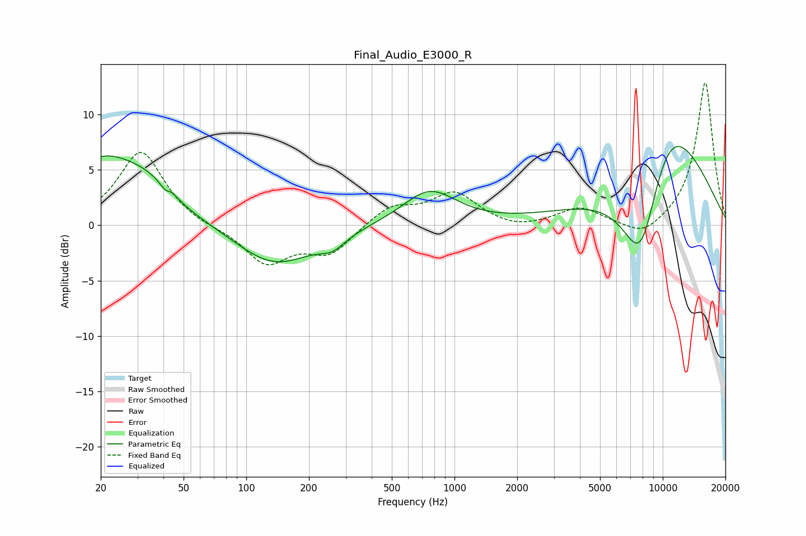

# Final_Audio_E3000_R
See [usage instructions](https://github.com/jaakkopasanen/AutoEq#usage) for more options and info.

### Parametric EQs
Apply preamp of -7.2 dB when using parametric equalizer.

|   # | Type    |   Fc (Hz) |    Q |   Gain (dB) |
|-----|---------|-----------|------|-------------|
|   1 | Peaking |        21 | 0.66 |         6.1 |
|   2 | Peaking |        34 | 1.48 |         1   |
|   3 | Peaking |        42 | 5.62 |        -1.1 |
|   4 | Peaking |        43 | 5.4  |         1   |
|   5 | Peaking |       139 | 0.76 |        -3.8 |
|   6 | Peaking |       156 | 1.18 |         0.2 |
|   7 | Peaking |       260 | 2.32 |        -1   |
|   8 | Peaking |       759 | 1.1  |         3.2 |
|   9 | Peaking |      7875 | 1.16 |       -12.2 |
|  10 | Peaking |     10000 | 0.57 |        12.8 |

### Fixed Band EQs
When using fixed band (also called graphic) equalizer, apply preamp of **-12.9 dB** (if available) and set gains manually with these parameters.

|   # | Type    |   Fc (Hz) |    Q |   Gain (dB) |
|-----|---------|-----------|------|-------------|
|   1 | Peaking |        31 | 1.41 |         6.7 |
|   2 | Peaking |        62 | 1.41 |        -0.2 |
|   3 | Peaking |       125 | 1.41 |        -3.4 |
|   4 | Peaking |       250 | 1.41 |        -2.5 |
|   5 | Peaking |       500 | 1.41 |         1.7 |
|   6 | Peaking |      1000 | 1.41 |         2.8 |
|   7 | Peaking |      2000 | 1.41 |        -0.5 |
|   8 | Peaking |      4000 | 1.41 |         1.5 |
|   9 | Peaking |      8000 | 1.41 |        -1.3 |
|  10 | Peaking |     16000 | 1.41 |        13   |

### Graphs

