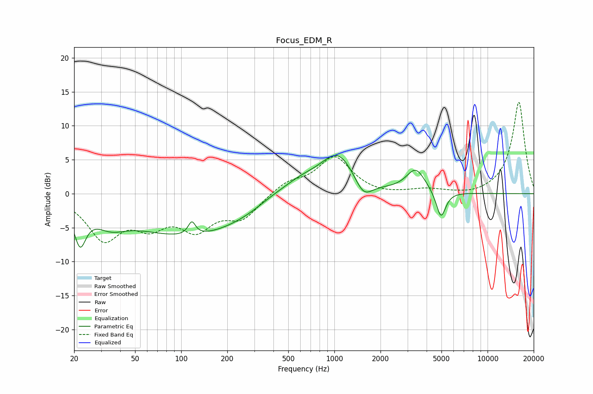

# Focus_EDM_R
See [usage instructions](https://github.com/jaakkopasanen/AutoEq#usage) for more options and info.

### Parametric EQs
Apply preamp of -5.7 dB when using parametric equalizer.

|   # | Type    |   Fc (Hz) |    Q |   Gain (dB) |
|-----|---------|-----------|------|-------------|
|   1 | Peaking |        22 | 3.67 |        -5.5 |
|   2 | Peaking |        34 | 1.4  |        -2.3 |
|   3 | Peaking |       115 | 0.34 |        -6.2 |
|   4 | Peaking |       117 | 6    |         2   |
|   5 | Peaking |       378 | 1.36 |         0.6 |
|   6 | Peaking |       593 | 0.98 |         2.3 |
|   7 | Peaking |      1061 | 1.23 |         5.7 |
|   8 | Peaking |      1547 | 2.4  |        -2.9 |
|   9 | Peaking |      3399 | 2.27 |         3.4 |
|  10 | Peaking |      4960 | 4.48 |        -4.1 |

### Fixed Band EQs
When using fixed band (also called graphic) equalizer, apply preamp of **-13.6 dB** (if available) and set gains manually with these parameters.

|   # | Type    |   Fc (Hz) |    Q |   Gain (dB) |
|-----|---------|-----------|------|-------------|
|   1 | Peaking |        31 | 1.41 |        -6.3 |
|   2 | Peaking |        62 | 1.41 |        -3.8 |
|   3 | Peaking |       125 | 1.41 |        -4.6 |
|   4 | Peaking |       250 | 1.41 |        -3.3 |
|   5 | Peaking |       500 | 1.41 |         1.6 |
|   6 | Peaking |      1000 | 1.41 |         5.3 |
|   7 | Peaking |      2000 | 1.41 |        -0.3 |
|   8 | Peaking |      4000 | 1.41 |         0.6 |
|   9 | Peaking |      8000 | 1.41 |        -0.4 |
|  10 | Peaking |     16000 | 1.41 |        13.6 |

### Graphs

