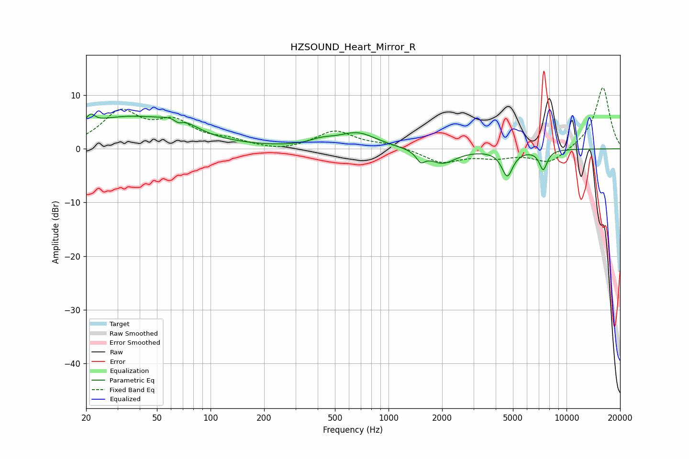

# HZSOUND_Heart_Mirror_R
See [usage instructions](https://github.com/jaakkopasanen/AutoEq#usage) for more options and info.

### Parametric EQs
Apply preamp of -6.6 dB when using parametric equalizer.

|   # | Type    |   Fc (Hz) |    Q |   Gain (dB) |
|-----|---------|-----------|------|-------------|
|   1 | Peaking |        21 | 5.88 |         1.7 |
|   2 | Peaking |        34 | 0.49 |         5.7 |
|   3 | Peaking |        66 | 5.87 |        -1   |
|   4 | Peaking |        66 | 1.63 |         2.1 |
|   5 | Peaking |       421 | 2.04 |         0.9 |
|   6 | Peaking |       670 | 1.3  |         2.9 |
|   7 | Peaking |      1517 | 5.91 |        -1.8 |
|   8 | Peaking |      2009 | 1.87 |        -2.7 |
|   9 | Peaking |      4647 | 4.48 |        -4.8 |
|  10 | Peaking |      7399 | 6    |        -3.7 |

### Fixed Band EQs
When using fixed band (also called graphic) equalizer, apply preamp of **-11.5 dB** (if available) and set gains manually with these parameters.

|   # | Type    |   Fc (Hz) |    Q |   Gain (dB) |
|-----|---------|-----------|------|-------------|
|   1 | Peaking |        31 | 1.41 |         6.5 |
|   2 | Peaking |        62 | 1.41 |         4.4 |
|   3 | Peaking |       125 | 1.41 |         1.2 |
|   4 | Peaking |       250 | 1.41 |        -0.6 |
|   5 | Peaking |       500 | 1.41 |         3.3 |
|   6 | Peaking |      1000 | 1.41 |         0.8 |
|   7 | Peaking |      2000 | 1.41 |        -2.5 |
|   8 | Peaking |      4000 | 1.41 |        -1.3 |
|   9 | Peaking |      8000 | 1.41 |        -2.8 |
|  10 | Peaking |     16000 | 1.41 |        11.6 |

### Graphs

