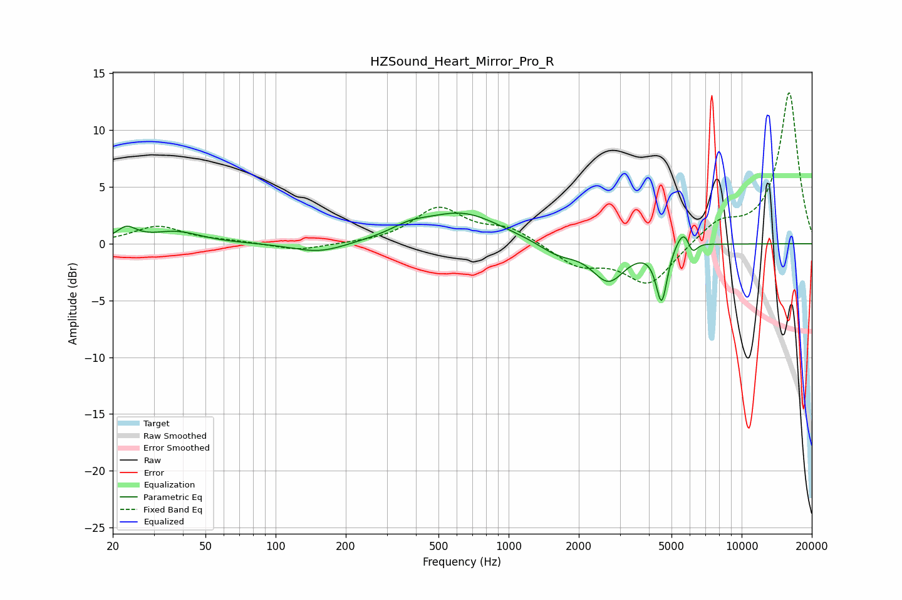

# HZSound_Heart_Mirror_Pro_R
See [usage instructions](https://github.com/jaakkopasanen/AutoEq#usage) for more options and info.

### Parametric EQs
Apply preamp of -2.8 dB when using parametric equalizer.

|   # | Type    |   Fc (Hz) |    Q |   Gain (dB) |
|-----|---------|-----------|------|-------------|
|   1 | Peaking |        23 | 3.32 |         1.2 |
|   2 | Peaking |        37 | 1.34 |         1   |
|   3 | Peaking |       154 | 1.24 |        -0.9 |
|   4 | Peaking |       377 | 1.68 |         0.8 |
|   5 | Peaking |       634 | 0.85 |         2.6 |
|   6 | Peaking |      1624 | 1.75 |        -1   |
|   7 | Peaking |      2683 | 1.98 |        -3.2 |
|   8 | Peaking |      4535 | 5.83 |        -4.9 |
|   9 | Peaking |      5711 | 3.63 |         2.2 |
|  10 | Peaking |      6118 | 6    |        -1.7 |

### Fixed Band EQs
When using fixed band (also called graphic) equalizer, apply preamp of **-13.4 dB** (if available) and set gains manually with these parameters.

|   # | Type    |   Fc (Hz) |    Q |   Gain (dB) |
|-----|---------|-----------|------|-------------|
|   1 | Peaking |        31 | 1.41 |         1.5 |
|   2 | Peaking |        62 | 1.41 |         0.2 |
|   3 | Peaking |       125 | 1.41 |        -0.6 |
|   4 | Peaking |       250 | 1.41 |        -0   |
|   5 | Peaking |       500 | 1.41 |         3.1 |
|   6 | Peaking |      1000 | 1.41 |         1.3 |
|   7 | Peaking |      2000 | 1.41 |        -1.8 |
|   8 | Peaking |      4000 | 1.41 |        -3.6 |
|   9 | Peaking |      8000 | 1.41 |         1.8 |
|  10 | Peaking |     16000 | 1.41 |        13.3 |

### Graphs

