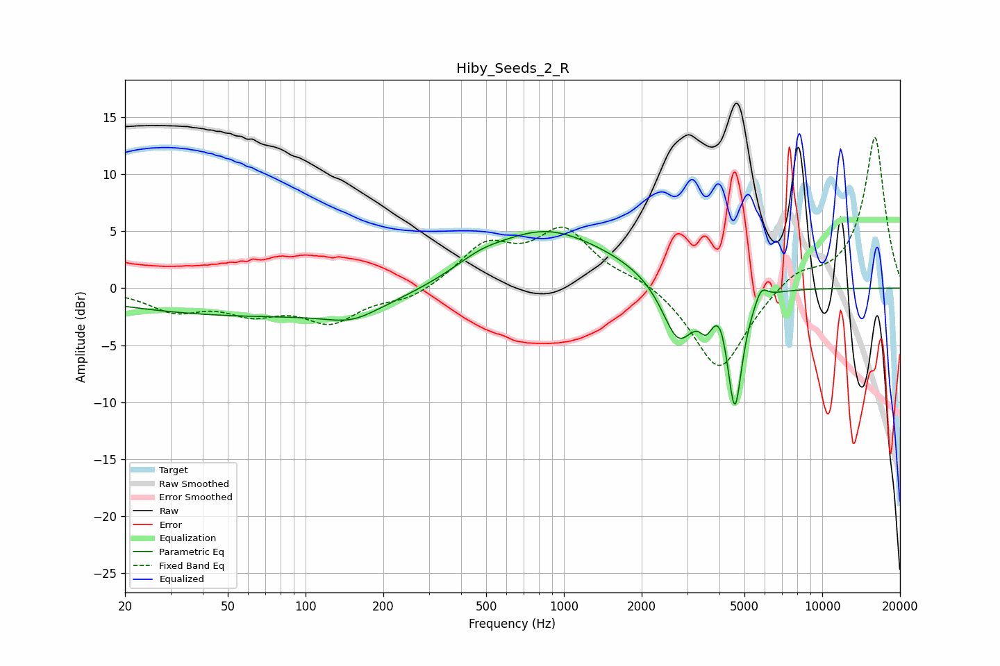

# Hiby_Seeds_2_R
See [usage instructions](https://github.com/jaakkopasanen/AutoEq#usage) for more options and info.

### Parametric EQs
Apply preamp of -5.1 dB when using parametric equalizer.

|   # | Type    |   Fc (Hz) |    Q |   Gain (dB) |
|-----|---------|-----------|------|-------------|
|   1 | Peaking |        88 | 0.18 |        -2.5 |
|   2 | Peaking |       151 | 1.4  |        -1.1 |
|   3 | Peaking |       474 | 1.54 |         0.7 |
|   4 | Peaking |       821 | 0.45 |         4.8 |
|   5 | Peaking |       843 | 1.04 |         0.8 |
|   6 | Peaking |      2770 | 2.22 |        -5.5 |
|   7 | Peaking |      3546 | 5.99 |        -1.7 |
|   8 | Peaking |      4036 | 6    |         1.2 |
|   9 | Peaking |      4587 | 4.77 |       -10.4 |
|  10 | Peaking |      5804 | 5.98 |         1.3 |

### Fixed Band EQs
When using fixed band (also called graphic) equalizer, apply preamp of **-13.3 dB** (if available) and set gains manually with these parameters.

|   # | Type    |   Fc (Hz) |    Q |   Gain (dB) |
|-----|---------|-----------|------|-------------|
|   1 | Peaking |        31 | 1.41 |        -1.8 |
|   2 | Peaking |        62 | 1.41 |        -1.8 |
|   3 | Peaking |       125 | 1.41 |        -2.8 |
|   4 | Peaking |       250 | 1.41 |        -1   |
|   5 | Peaking |       500 | 1.41 |         3.5 |
|   6 | Peaking |      1000 | 1.41 |         4.8 |
|   7 | Peaking |      2000 | 1.41 |         0.8 |
|   8 | Peaking |      4000 | 1.41 |        -7.5 |
|   9 | Peaking |      8000 | 1.41 |         1.5 |
|  10 | Peaking |     16000 | 1.41 |        13.3 |

### Graphs

