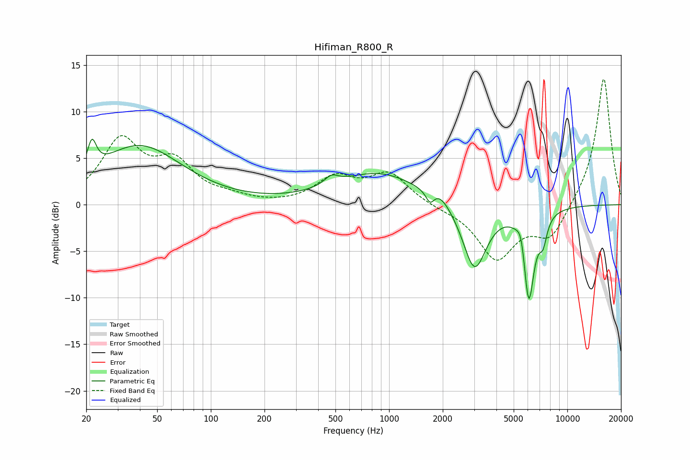

# Hifiman_R800_R
See [usage instructions](https://github.com/jaakkopasanen/AutoEq#usage) for more options and info.

### Parametric EQs
Apply preamp of -7.1 dB when using parametric equalizer.

|   # | Type    |   Fc (Hz) |    Q |   Gain (dB) |
|-----|---------|-----------|------|-------------|
|   1 | Peaking |        21 | 5.73 |         3.1 |
|   2 | Peaking |        40 | 0.59 |         6.3 |
|   3 | Peaking |       475 | 3.59 |         1   |
|   4 | Peaking |       877 | 0.6  |         3.4 |
|   5 | Peaking |      1698 | 5.98 |        -1.3 |
|   6 | Peaking |      1920 | 2.6  |         1   |
|   7 | Peaking |      3015 | 2.08 |        -7.3 |
|   8 | Peaking |      5522 | 5.96 |         2.1 |
|   9 | Peaking |      6073 | 4.46 |       -10.1 |
|  10 | Peaking |      7303 | 6    |        -2.4 |

### Fixed Band EQs
When using fixed band (also called graphic) equalizer, apply preamp of **-13.6 dB** (if available) and set gains manually with these parameters.

|   # | Type    |   Fc (Hz) |    Q |   Gain (dB) |
|-----|---------|-----------|------|-------------|
|   1 | Peaking |        31 | 1.41 |         6.6 |
|   2 | Peaking |        62 | 1.41 |         4   |
|   3 | Peaking |       125 | 1.41 |         0.6 |
|   4 | Peaking |       250 | 1.41 |        -0.1 |
|   5 | Peaking |       500 | 1.41 |         2.7 |
|   6 | Peaking |      1000 | 1.41 |         3.2 |
|   7 | Peaking |      2000 | 1.41 |        -0.3 |
|   8 | Peaking |      4000 | 1.41 |        -5.7 |
|   9 | Peaking |      8000 | 1.41 |        -3.5 |
|  10 | Peaking |     16000 | 1.41 |        13.8 |

### Graphs

