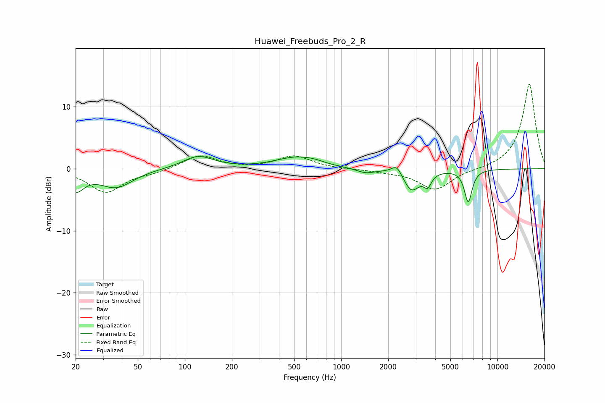

# Huawei_Freebuds_Pro_2_R
See [usage instructions](https://github.com/jaakkopasanen/AutoEq#usage) for more options and info.

### Parametric EQs
Apply preamp of -2.1 dB when using parametric equalizer.

|   # | Type    |   Fc (Hz) |    Q |   Gain (dB) |
|-----|---------|-----------|------|-------------|
|   1 | Peaking |        20 | 2.65 |        -3.1 |
|   2 | Peaking |        36 | 1.34 |        -2.9 |
|   3 | Peaking |       122 | 1.43 |         2   |
|   4 | Peaking |       509 | 1.07 |         1.7 |
|   5 | Peaking |       672 | 2.19 |         0.4 |
|   6 | Peaking |      1433 | 2.44 |        -0.7 |
|   7 | Peaking |      2272 | 4.3  |         1.6 |
|   8 | Peaking |      2818 | 2.65 |        -3.5 |
|   9 | Peaking |      3574 | 5.99 |        -1.9 |
|  10 | Peaking |      6502 | 5.64 |        -5.2 |

### Fixed Band EQs
When using fixed band (also called graphic) equalizer, apply preamp of **-13.7 dB** (if available) and set gains manually with these parameters.

|   # | Type    |   Fc (Hz) |    Q |   Gain (dB) |
|-----|---------|-----------|------|-------------|
|   1 | Peaking |        31 | 1.41 |        -3.8 |
|   2 | Peaking |        62 | 1.41 |        -0.5 |
|   3 | Peaking |       125 | 1.41 |         2.2 |
|   4 | Peaking |       250 | 1.41 |        -0   |
|   5 | Peaking |       500 | 1.41 |         2.1 |
|   6 | Peaking |      1000 | 1.41 |        -0.1 |
|   7 | Peaking |      2000 | 1.41 |        -0.4 |
|   8 | Peaking |      4000 | 1.41 |        -3.4 |
|   9 | Peaking |      8000 | 1.41 |        -0.1 |
|  10 | Peaking |     16000 | 1.41 |        13.8 |

### Graphs

