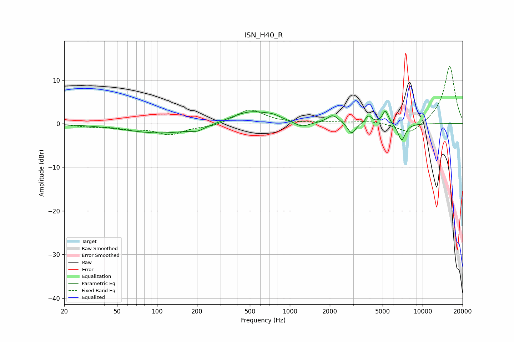

# ISN_H40_R
See [usage instructions](https://github.com/jaakkopasanen/AutoEq#usage) for more options and info.

### Parametric EQs
Apply preamp of -2.9 dB when using parametric equalizer.

|   # | Type    |   Fc (Hz) |    Q |   Gain (dB) |
|-----|---------|-----------|------|-------------|
|   1 | Peaking |       110 | 0.51 |        -2.3 |
|   2 | Peaking |       202 | 2.86 |        -0.8 |
|   3 | Peaking |       504 | 0.92 |         3   |
|   4 | Peaking |       747 | 2.63 |         0.6 |
|   5 | Peaking |      1228 | 2.55 |        -1.3 |
|   6 | Peaking |      2108 | 3.39 |         1.9 |
|   7 | Peaking |      2924 | 4.91 |        -2.6 |
|   8 | Peaking |      3917 | 6    |         1.8 |
|   9 | Peaking |      5248 | 6    |         3.1 |
|  10 | Peaking |      6953 | 4.94 |        -3.9 |

### Fixed Band EQs
When using fixed band (also called graphic) equalizer, apply preamp of **-13.3 dB** (if available) and set gains manually with these parameters.

|   # | Type    |   Fc (Hz) |    Q |   Gain (dB) |
|-----|---------|-----------|------|-------------|
|   1 | Peaking |        31 | 1.41 |        -0.6 |
|   2 | Peaking |        62 | 1.41 |        -0.9 |
|   3 | Peaking |       125 | 1.41 |        -2.4 |
|   4 | Peaking |       250 | 1.41 |        -0.7 |
|   5 | Peaking |       500 | 1.41 |         3.3 |
|   6 | Peaking |      1000 | 1.41 |         0.1 |
|   7 | Peaking |      2000 | 1.41 |         0.3 |
|   8 | Peaking |      4000 | 1.41 |         0.5 |
|   9 | Peaking |      8000 | 1.41 |        -2.7 |
|  10 | Peaking |     16000 | 1.41 |        13.4 |

### Graphs

