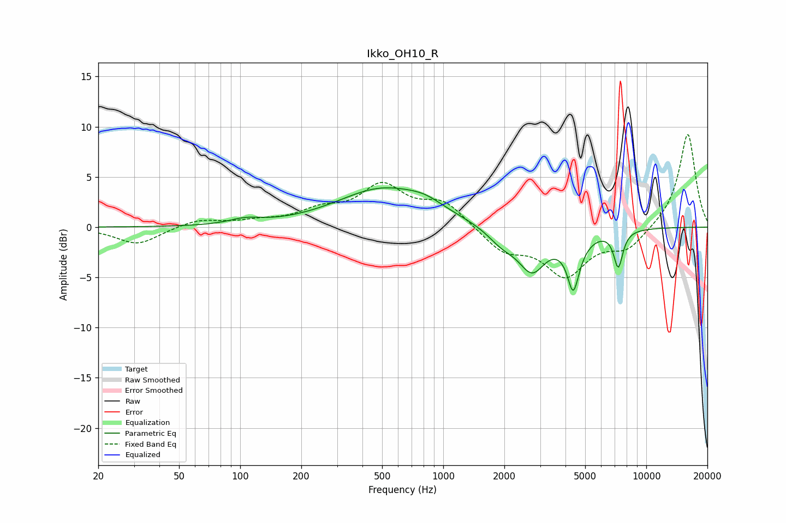

# Ikko_OH10_R
See [usage instructions](https://github.com/jaakkopasanen/AutoEq#usage) for more options and info.

### Parametric EQs
Apply preamp of -4.0 dB when using parametric equalizer.

|   # | Type    |   Fc (Hz) |    Q |   Gain (dB) |
|-----|---------|-----------|------|-------------|
|   1 | Peaking |       106 | 1.81 |         0.5 |
|   2 | Peaking |       505 | 0.63 |         3.8 |
|   3 | Peaking |       816 | 1.62 |         0.8 |
|   4 | Peaking |      1954 | 1.89 |        -1.5 |
|   5 | Peaking |      2738 | 2.11 |        -3.9 |
|   6 | Peaking |      4247 | 3.6  |         2.1 |
|   7 | Peaking |      4348 | 3.29 |        -7.3 |
|   8 | Peaking |      4365 | 5.93 |        -2.2 |
|   9 | Peaking |      4400 | 3.42 |         2   |
|  10 | Peaking |      7281 | 6    |        -3.6 |

### Fixed Band EQs
When using fixed band (also called graphic) equalizer, apply preamp of **-9.3 dB** (if available) and set gains manually with these parameters.

|   # | Type    |   Fc (Hz) |    Q |   Gain (dB) |
|-----|---------|-----------|------|-------------|
|   1 | Peaking |        31 | 1.41 |        -1.7 |
|   2 | Peaking |        62 | 1.41 |         0.8 |
|   3 | Peaking |       125 | 1.41 |         0.5 |
|   4 | Peaking |       250 | 1.41 |         1.4 |
|   5 | Peaking |       500 | 1.41 |         3.9 |
|   6 | Peaking |      1000 | 1.41 |         2.4 |
|   7 | Peaking |      2000 | 1.41 |        -2.3 |
|   8 | Peaking |      4000 | 1.41 |        -4.6 |
|   9 | Peaking |      8000 | 1.41 |        -2   |
|  10 | Peaking |     16000 | 1.41 |         9.4 |

### Graphs

