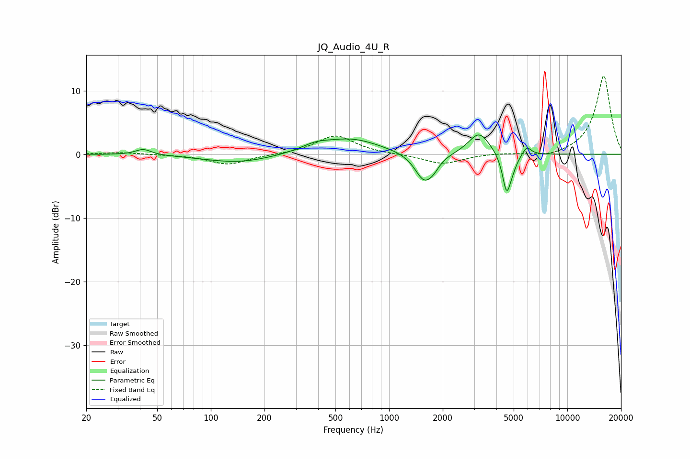

# JQ_Audio_4U_R
See [usage instructions](https://github.com/jaakkopasanen/AutoEq#usage) for more options and info.

### Parametric EQs
Apply preamp of -3.1 dB when using parametric equalizer.

|   # | Type    |   Fc (Hz) |    Q |   Gain (dB) |
|-----|---------|-----------|------|-------------|
|   1 | Peaking |        42 | 3.23 |         0.9 |
|   2 | Peaking |       143 | 0.75 |        -1.3 |
|   3 | Peaking |       385 | 1.74 |         0.9 |
|   4 | Peaking |       615 | 0.87 |         2.4 |
|   5 | Peaking |      1573 | 2.72 |        -4.3 |
|   6 | Peaking |      1784 | 4.34 |        -0.9 |
|   7 | Peaking |      3200 | 2.41 |         3.5 |
|   8 | Peaking |      4558 | 6    |        -5.7 |
|   9 | Peaking |      4893 | 5.04 |        -1.4 |
|  10 | Peaking |      5923 | 5.7  |         1.4 |

### Fixed Band EQs
When using fixed band (also called graphic) equalizer, apply preamp of **-12.4 dB** (if available) and set gains manually with these parameters.

|   # | Type    |   Fc (Hz) |    Q |   Gain (dB) |
|-----|---------|-----------|------|-------------|
|   1 | Peaking |        31 | 1.41 |         0.3 |
|   2 | Peaking |        62 | 1.41 |        -0.1 |
|   3 | Peaking |       125 | 1.41 |        -1.6 |
|   4 | Peaking |       250 | 1.41 |        -0   |
|   5 | Peaking |       500 | 1.41 |         3   |
|   6 | Peaking |      1000 | 1.41 |        -0   |
|   7 | Peaking |      2000 | 1.41 |        -1.6 |
|   8 | Peaking |      4000 | 1.41 |         0.2 |
|   9 | Peaking |      8000 | 1.41 |        -0.6 |
|  10 | Peaking |     16000 | 1.41 |        12.4 |

### Graphs

