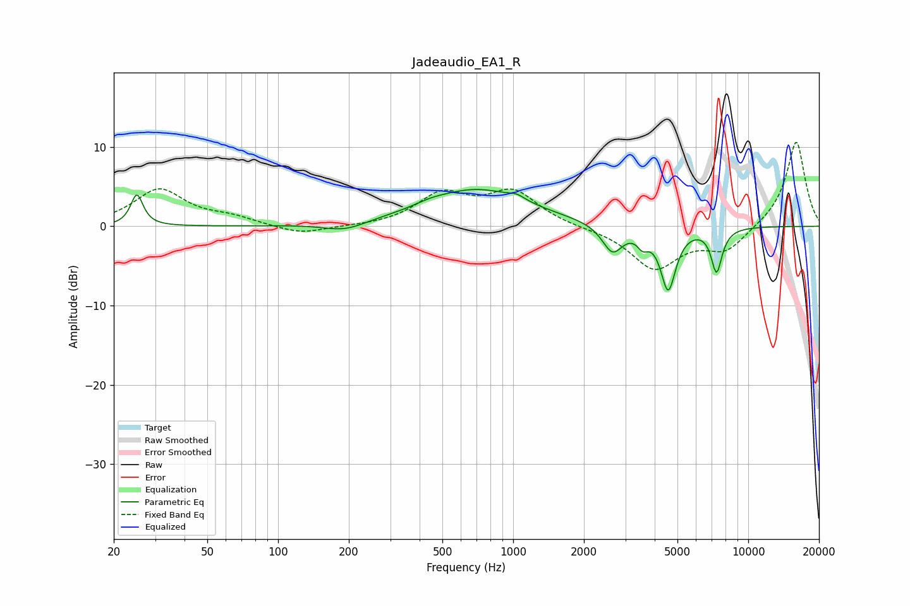

# Jadeaudio_EA1_R
See [usage instructions](https://github.com/jaakkopasanen/AutoEq#usage) for more options and info.

### Parametric EQs
Apply preamp of -4.7 dB when using parametric equalizer.

|   # | Type    |   Fc (Hz) |    Q |   Gain (dB) |
|-----|---------|-----------|------|-------------|
|   1 | Peaking |        25 | 5.66 |         3.9 |
|   2 | Peaking |       192 | 1.61 |        -1.1 |
|   3 | Peaking |       443 | 2.34 |         0.3 |
|   4 | Peaking |       700 | 0.65 |         4.6 |
|   5 | Peaking |      1037 | 4.17 |         0.6 |
|   6 | Peaking |      2646 | 3.21 |        -3.5 |
|   7 | Peaking |      3558 | 6    |        -1.5 |
|   8 | Peaking |      4567 | 4.32 |        -7.8 |
|   9 | Peaking |      7326 | 6    |        -5.2 |
|  10 | Peaking |      7628 | 3.81 |        -0.4 |

### Fixed Band EQs
When using fixed band (also called graphic) equalizer, apply preamp of **-10.7 dB** (if available) and set gains manually with these parameters.

|   # | Type    |   Fc (Hz) |    Q |   Gain (dB) |
|-----|---------|-----------|------|-------------|
|   1 | Peaking |        31 | 1.41 |         4.6 |
|   2 | Peaking |        62 | 1.41 |         0.9 |
|   3 | Peaking |       125 | 1.41 |        -1.1 |
|   4 | Peaking |       250 | 1.41 |        -0.1 |
|   5 | Peaking |       500 | 1.41 |         3.8 |
|   6 | Peaking |      1000 | 1.41 |         4.2 |
|   7 | Peaking |      2000 | 1.41 |        -0.2 |
|   8 | Peaking |      4000 | 1.41 |        -5.3 |
|   9 | Peaking |      8000 | 1.41 |        -3   |
|  10 | Peaking |     16000 | 1.41 |        10.9 |

### Graphs

