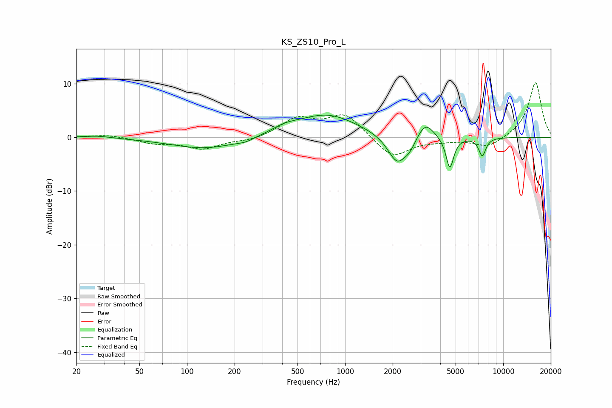

# KS_ZS10_Pro_L
See [usage instructions](https://github.com/jaakkopasanen/AutoEq#usage) for more options and info.

### Parametric EQs
Apply preamp of -4.2 dB when using parametric equalizer.

|   # | Type    |   Fc (Hz) |    Q |   Gain (dB) |
|-----|---------|-----------|------|-------------|
|   1 | Peaking |        27 | 1.67 |         0.4 |
|   2 | Peaking |       133 | 0.63 |        -2.2 |
|   3 | Peaking |       235 | 2.83 |        -0.5 |
|   4 | Peaking |       413 | 1.66 |         1   |
|   5 | Peaking |       764 | 0.73 |         4.3 |
|   6 | Peaking |      2138 | 2.31 |        -5.4 |
|   7 | Peaking |      2570 | 3.95 |        -1.4 |
|   8 | Peaking |      3220 | 2.73 |         3.2 |
|   9 | Peaking |      4597 | 5.73 |        -5.9 |
|  10 | Peaking |      7373 | 6    |        -3.4 |

### Fixed Band EQs
When using fixed band (also called graphic) equalizer, apply preamp of **-10.2 dB** (if available) and set gains manually with these parameters.

|   # | Type    |   Fc (Hz) |    Q |   Gain (dB) |
|-----|---------|-----------|------|-------------|
|   1 | Peaking |        31 | 1.41 |         0.5 |
|   2 | Peaking |        62 | 1.41 |        -1   |
|   3 | Peaking |       125 | 1.41 |        -2.1 |
|   4 | Peaking |       250 | 1.41 |        -0.7 |
|   5 | Peaking |       500 | 1.41 |         3.4 |
|   6 | Peaking |      1000 | 1.41 |         4.2 |
|   7 | Peaking |      2000 | 1.41 |        -3.9 |
|   8 | Peaking |      4000 | 1.41 |        -0.5 |
|   9 | Peaking |      8000 | 1.41 |        -1.9 |
|  10 | Peaking |     16000 | 1.41 |        10.3 |

### Graphs

