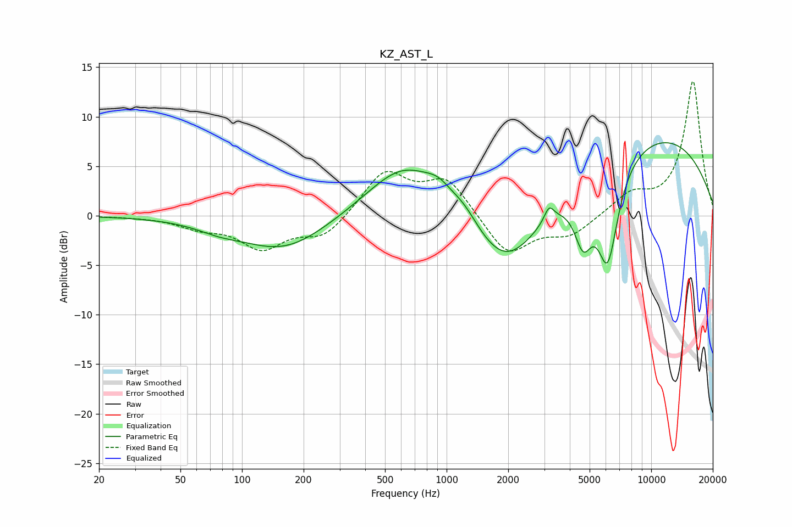

# KZ_AST_L
See [usage instructions](https://github.com/jaakkopasanen/AutoEq#usage) for more options and info.

### Parametric EQs
Apply preamp of -7.5 dB when using parametric equalizer.

|   # | Type    |   Fc (Hz) |    Q |   Gain (dB) |
|-----|---------|-----------|------|-------------|
|   1 | Peaking |        76 | 1.34 |        -0.6 |
|   2 | Peaking |       160 | 0.66 |        -3.5 |
|   3 | Peaking |       623 | 0.78 |         5.4 |
|   4 | Peaking |       915 | 2.18 |         1.4 |
|   5 | Peaking |      1219 | 2    |         1.4 |
|   6 | Peaking |      1950 | 0.84 |        -6.7 |
|   7 | Peaking |      3168 | 6    |         1.5 |
|   8 | Peaking |      4654 | 3.19 |        -5   |
|   9 | Peaking |      6129 | 2.56 |        -9.9 |
|  10 | Peaking |      9953 | 0.3  |         8.3 |

### Fixed Band EQs
When using fixed band (also called graphic) equalizer, apply preamp of **-13.7 dB** (if available) and set gains manually with these parameters.

|   # | Type    |   Fc (Hz) |    Q |   Gain (dB) |
|-----|---------|-----------|------|-------------|
|   1 | Peaking |        31 | 1.41 |        -0   |
|   2 | Peaking |        62 | 1.41 |        -1   |
|   3 | Peaking |       125 | 1.41 |        -3.1 |
|   4 | Peaking |       250 | 1.41 |        -2.2 |
|   5 | Peaking |       500 | 1.41 |         4.4 |
|   6 | Peaking |      1000 | 1.41 |         3.7 |
|   7 | Peaking |      2000 | 1.41 |        -4.1 |
|   8 | Peaking |      4000 | 1.41 |        -1.9 |
|   9 | Peaking |      8000 | 1.41 |         2   |
|  10 | Peaking |     16000 | 1.41 |        13.6 |

### Graphs

