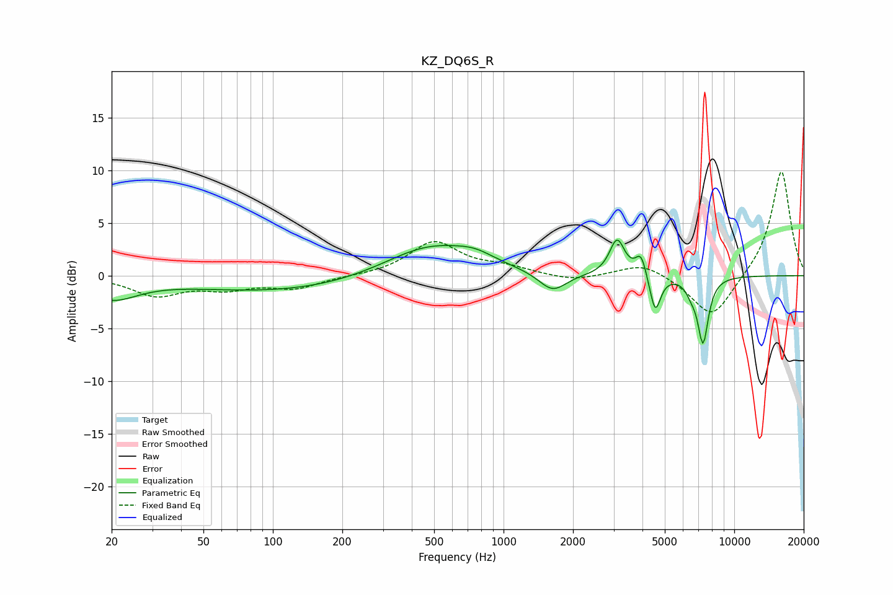

# KZ_DQ6S_R
See [usage instructions](https://github.com/jaakkopasanen/AutoEq#usage) for more options and info.

### Parametric EQs
Apply preamp of -3.5 dB when using parametric equalizer.

|   # | Type    |   Fc (Hz) |    Q |   Gain (dB) |
|-----|---------|-----------|------|-------------|
|   1 | Peaking |        20 | 1.25 |        -2   |
|   2 | Peaking |       109 | 0.35 |        -1.5 |
|   3 | Peaking |       482 | 0.71 |         3.1 |
|   4 | Peaking |       754 | 1.72 |         0.8 |
|   5 | Peaking |      1632 | 2.35 |        -1.9 |
|   6 | Peaking |      3106 | 4.35 |         3.4 |
|   7 | Peaking |      3945 | 6    |         2.1 |
|   8 | Peaking |      4542 | 6    |        -3.6 |
|   9 | Peaking |      6509 | 6    |        -0.9 |
|  10 | Peaking |      7322 | 5.76 |        -6.2 |

### Fixed Band EQs
When using fixed band (also called graphic) equalizer, apply preamp of **-9.9 dB** (if available) and set gains manually with these parameters.

|   # | Type    |   Fc (Hz) |    Q |   Gain (dB) |
|-----|---------|-----------|------|-------------|
|   1 | Peaking |        31 | 1.41 |        -1.8 |
|   2 | Peaking |        62 | 1.41 |        -1.1 |
|   3 | Peaking |       125 | 1.41 |        -1.1 |
|   4 | Peaking |       250 | 1.41 |        -0   |
|   5 | Peaking |       500 | 1.41 |         3.2 |
|   6 | Peaking |      1000 | 1.41 |         0.7 |
|   7 | Peaking |      2000 | 1.41 |        -0.6 |
|   8 | Peaking |      4000 | 1.41 |         1.3 |
|   9 | Peaking |      8000 | 1.41 |        -4.2 |
|  10 | Peaking |     16000 | 1.41 |        10.1 |

### Graphs

