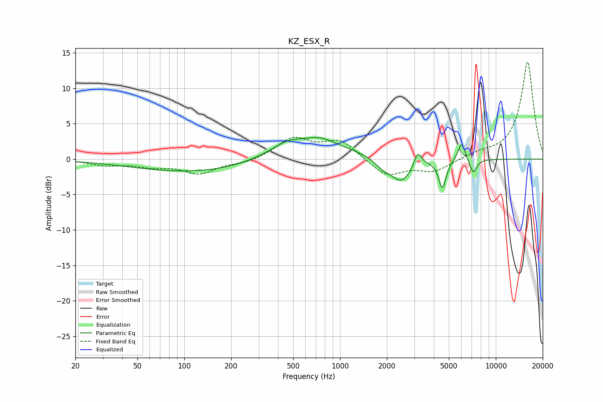

# KZ_ESX_R
See [usage instructions](https://github.com/jaakkopasanen/AutoEq#usage) for more options and info.

### Parametric EQs
Apply preamp of -3.1 dB when using parametric equalizer.

|   # | Type    |   Fc (Hz) |    Q |   Gain (dB) |
|-----|---------|-----------|------|-------------|
|   1 | Peaking |       137 | 0.31 |        -2   |
|   2 | Peaking |       454 | 1.82 |         0.7 |
|   3 | Peaking |       604 | 0.58 |         3.2 |
|   4 | Peaking |       755 | 2.28 |         0.5 |
|   5 | Peaking |      1877 | 2.64 |        -1   |
|   6 | Peaking |      2475 | 2.05 |        -3.3 |
|   7 | Peaking |      3160 | 5.87 |         2.2 |
|   8 | Peaking |      4540 | 6    |        -4   |
|   9 | Peaking |      6031 | 5.83 |         2.6 |
|  10 | Peaking |      7166 | 6    |        -2.1 |

### Fixed Band EQs
When using fixed band (also called graphic) equalizer, apply preamp of **-13.8 dB** (if available) and set gains manually with these parameters.

|   # | Type    |   Fc (Hz) |    Q |   Gain (dB) |
|-----|---------|-----------|------|-------------|
|   1 | Peaking |        31 | 1.41 |        -0.8 |
|   2 | Peaking |        62 | 1.41 |        -0.9 |
|   3 | Peaking |       125 | 1.41 |        -2   |
|   4 | Peaking |       250 | 1.41 |        -0.5 |
|   5 | Peaking |       500 | 1.41 |         2.8 |
|   6 | Peaking |      1000 | 1.41 |         2.6 |
|   7 | Peaking |      2000 | 1.41 |        -2.4 |
|   8 | Peaking |      4000 | 1.41 |        -1.7 |
|   9 | Peaking |      8000 | 1.41 |         0.7 |
|  10 | Peaking |     16000 | 1.41 |        13.8 |

### Graphs

