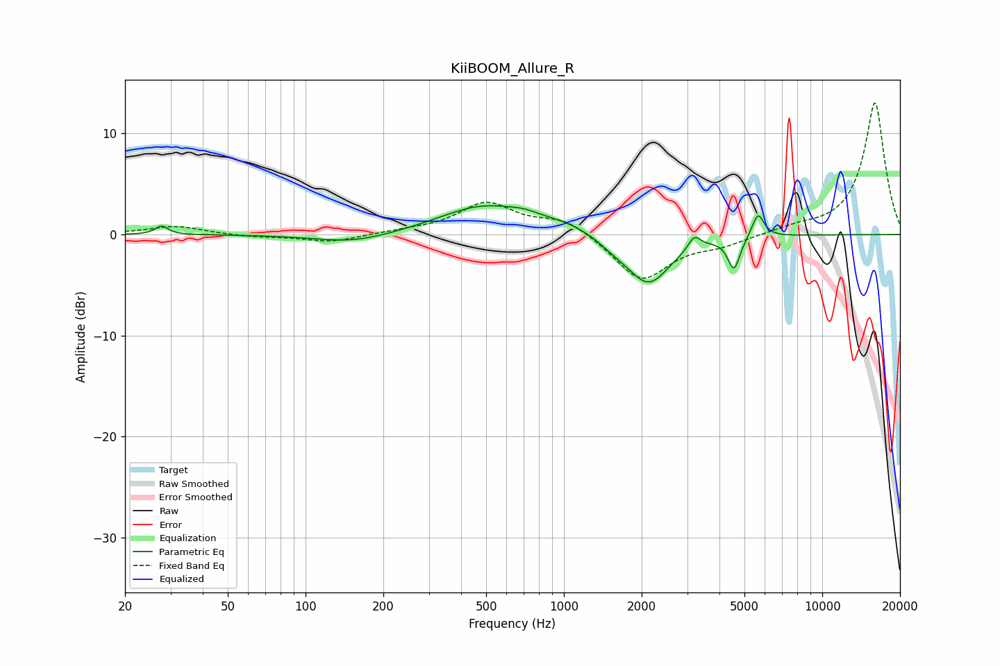

# KiiBOOM_Allure_R
See [usage instructions](https://github.com/jaakkopasanen/AutoEq#usage) for more options and info.

### Parametric EQs
Apply preamp of -2.9 dB when using parametric equalizer.

|   # | Type    |   Fc (Hz) |    Q |   Gain (dB) |
|-----|---------|-----------|------|-------------|
|   1 | Peaking |        28 | 5.99 |         0.9 |
|   2 | Peaking |       154 | 0.94 |        -0.9 |
|   3 | Peaking |       489 | 0.82 |         2.8 |
|   4 | Peaking |       705 | 2.48 |         0.4 |
|   5 | Peaking |      1021 | 1.32 |         0.8 |
|   6 | Peaking |      1551 | 2.58 |        -0.6 |
|   7 | Peaking |      2122 | 1.66 |        -4.9 |
|   8 | Peaking |      3199 | 6    |         1.3 |
|   9 | Peaking |      4554 | 6    |        -3.2 |
|  10 | Peaking |      5640 | 5.99 |         2.4 |

### Fixed Band EQs
When using fixed band (also called graphic) equalizer, apply preamp of **-13.1 dB** (if available) and set gains manually with these parameters.

|   # | Type    |   Fc (Hz) |    Q |   Gain (dB) |
|-----|---------|-----------|------|-------------|
|   1 | Peaking |        31 | 1.41 |         0.8 |
|   2 | Peaking |        62 | 1.41 |        -0.2 |
|   3 | Peaking |       125 | 1.41 |        -0.8 |
|   4 | Peaking |       250 | 1.41 |         0.3 |
|   5 | Peaking |       500 | 1.41 |         3   |
|   6 | Peaking |      1000 | 1.41 |         1.6 |
|   7 | Peaking |      2000 | 1.41 |        -4.6 |
|   8 | Peaking |      4000 | 1.41 |        -0.9 |
|   9 | Peaking |      8000 | 1.41 |         0.6 |
|  10 | Peaking |     16000 | 1.41 |        13.1 |

### Graphs

