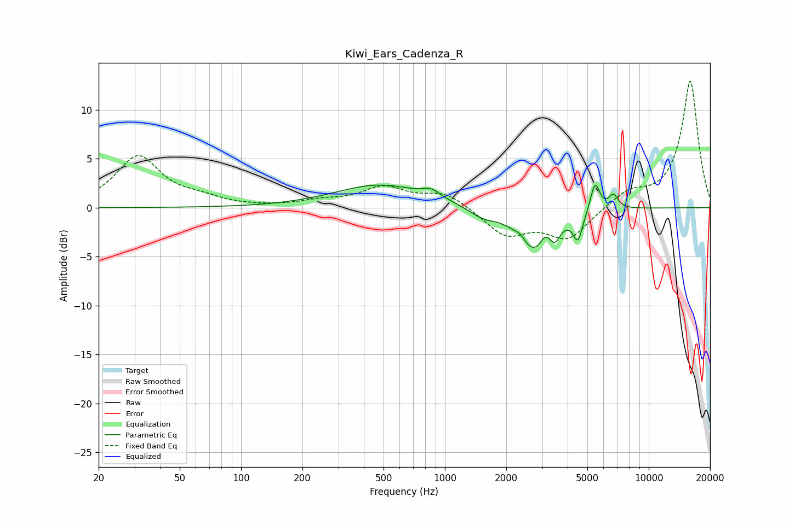

# Kiwi_Ears_Cadenza_R
See [usage instructions](https://github.com/jaakkopasanen/AutoEq#usage) for more options and info.

### Parametric EQs
Apply preamp of -2.4 dB when using parametric equalizer.

|   # | Type    |   Fc (Hz) |    Q |   Gain (dB) |
|-----|---------|-----------|------|-------------|
|   1 | Peaking |       476 | 0.66 |         2.3 |
|   2 | Peaking |       859 | 3.07 |         0.8 |
|   3 | Peaking |      1534 | 2.17 |        -0.9 |
|   4 | Peaking |      2349 | 5.33 |         0.6 |
|   5 | Peaking |      2729 | 1.74 |        -4.4 |
|   6 | Peaking |      3088 | 6    |         1   |
|   7 | Peaking |      3474 | 6    |        -1.3 |
|   8 | Peaking |      4495 | 6    |        -2.7 |
|   9 | Peaking |      5454 | 5.99 |         3   |
|  10 | Peaking |      6713 | 5.99 |         1.4 |

### Fixed Band EQs
When using fixed band (also called graphic) equalizer, apply preamp of **-13.0 dB** (if available) and set gains manually with these parameters.

|   # | Type    |   Fc (Hz) |    Q |   Gain (dB) |
|-----|---------|-----------|------|-------------|
|   1 | Peaking |        31 | 1.41 |         5.2 |
|   2 | Peaking |        62 | 1.41 |         0.7 |
|   3 | Peaking |       125 | 1.41 |         0   |
|   4 | Peaking |       250 | 1.41 |         0.6 |
|   5 | Peaking |       500 | 1.41 |         2   |
|   6 | Peaking |      1000 | 1.41 |         1.5 |
|   7 | Peaking |      2000 | 1.41 |        -2.8 |
|   8 | Peaking |      4000 | 1.41 |        -3.1 |
|   9 | Peaking |      8000 | 1.41 |         1.5 |
|  10 | Peaking |     16000 | 1.41 |        13   |

### Graphs

