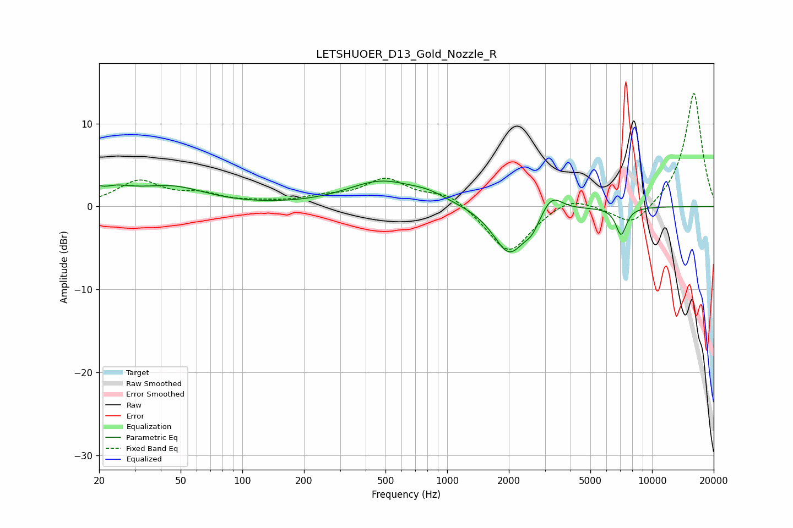

# LETSHUOER_D13_Gold_Nozzle_R
See [usage instructions](https://github.com/jaakkopasanen/AutoEq#usage) for more options and info.

### Parametric EQs
Apply preamp of -3.2 dB when using parametric equalizer.

|   # | Type    |   Fc (Hz) |    Q |   Gain (dB) |
|-----|---------|-----------|------|-------------|
|   1 | Peaking |        20 | 1.25 |         2.7 |
|   2 | Peaking |        21 | 3.4  |        -0.8 |
|   3 | Peaking |        46 | 0.87 |         2   |
|   4 | Peaking |        62 | 0.99 |         0   |
|   5 | Peaking |       476 | 0.84 |         2.9 |
|   6 | Peaking |       813 | 1.53 |         0.9 |
|   7 | Peaking |      2009 | 1.81 |        -5.7 |
|   8 | Peaking |      2599 | 3.79 |        -1.5 |
|   9 | Peaking |      3230 | 2.76 |         2.3 |
|  10 | Peaking |      7069 | 5.23 |        -3.3 |

### Fixed Band EQs
When using fixed band (also called graphic) equalizer, apply preamp of **-13.7 dB** (if available) and set gains manually with these parameters.

|   # | Type    |   Fc (Hz) |    Q |   Gain (dB) |
|-----|---------|-----------|------|-------------|
|   1 | Peaking |        31 | 1.41 |         2.9 |
|   2 | Peaking |        62 | 1.41 |         1.2 |
|   3 | Peaking |       125 | 1.41 |         0.3 |
|   4 | Peaking |       250 | 1.41 |         0.9 |
|   5 | Peaking |       500 | 1.41 |         3.1 |
|   6 | Peaking |      1000 | 1.41 |         1.7 |
|   7 | Peaking |      2000 | 1.41 |        -5.8 |
|   8 | Peaking |      4000 | 1.41 |         1.5 |
|   9 | Peaking |      8000 | 1.41 |        -2.6 |
|  10 | Peaking |     16000 | 1.41 |        13.9 |

### Graphs

