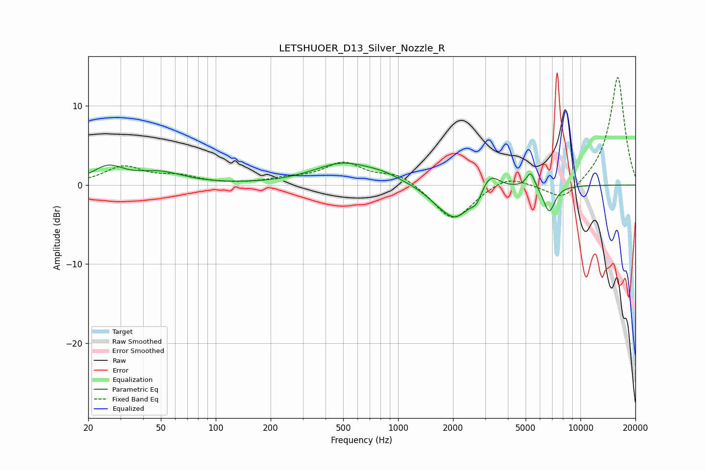

# LETSHUOER_D13_Silver_Nozzle_R
See [usage instructions](https://github.com/jaakkopasanen/AutoEq#usage) for more options and info.

### Parametric EQs
Apply preamp of -2.9 dB when using parametric equalizer.

|   # | Type    |   Fc (Hz) |    Q |   Gain (dB) |
|-----|---------|-----------|------|-------------|
|   1 | Peaking |        26 | 1.67 |         2.1 |
|   2 | Peaking |        50 | 1.09 |         1.4 |
|   3 | Peaking |       500 | 0.87 |         2.7 |
|   4 | Peaking |       833 | 1.54 |         0.7 |
|   5 | Peaking |      1583 | 2.32 |        -0.5 |
|   6 | Peaking |      2054 | 1.64 |        -4.2 |
|   7 | Peaking |      2688 | 5.03 |        -1.3 |
|   8 | Peaking |      3191 | 2.85 |         2.3 |
|   9 | Peaking |      5326 | 6    |         2   |
|  10 | Peaking |      6734 | 4.32 |        -3.4 |

### Fixed Band EQs
When using fixed band (also called graphic) equalizer, apply preamp of **-13.7 dB** (if available) and set gains manually with these parameters.

|   # | Type    |   Fc (Hz) |    Q |   Gain (dB) |
|-----|---------|-----------|------|-------------|
|   1 | Peaking |        31 | 1.41 |         2.2 |
|   2 | Peaking |        62 | 1.41 |         1   |
|   3 | Peaking |       125 | 1.41 |         0   |
|   4 | Peaking |       250 | 1.41 |         0.7 |
|   5 | Peaking |       500 | 1.41 |         2.7 |
|   6 | Peaking |      1000 | 1.41 |         1.4 |
|   7 | Peaking |      2000 | 1.41 |        -4.6 |
|   8 | Peaking |      4000 | 1.41 |         1.3 |
|   9 | Peaking |      8000 | 1.41 |        -2.3 |
|  10 | Peaking |     16000 | 1.41 |        13.8 |

### Graphs

