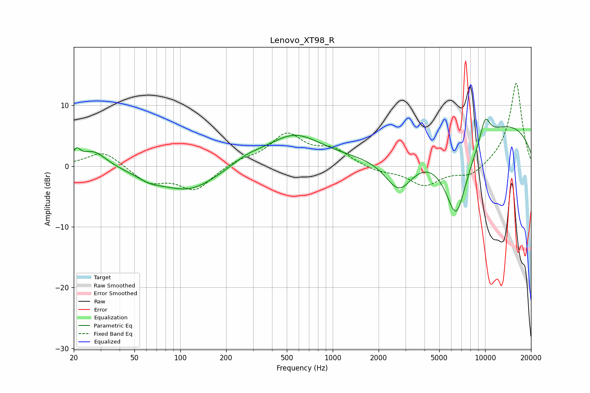

# Lenovo_XT98_R
See [usage instructions](https://github.com/jaakkopasanen/AutoEq#usage) for more options and info.

### Parametric EQs
Apply preamp of -7.8 dB when using parametric equalizer.

|   # | Type    |   Fc (Hz) |    Q |   Gain (dB) |
|-----|---------|-----------|------|-------------|
|   1 | Peaking |        21 | 5.76 |         1.8 |
|   2 | Peaking |        27 | 1.73 |         2.6 |
|   3 | Peaking |        63 | 1.64 |        -1.1 |
|   4 | Peaking |       114 | 0.75 |        -4.1 |
|   5 | Peaking |       274 | 1.4  |         1.1 |
|   6 | Peaking |       558 | 0.77 |         5   |
|   7 | Peaking |      2729 | 1.43 |        -6.6 |
|   8 | Peaking |      6460 | 1.51 |       -14.4 |
|   9 | Peaking |     10000 | 3.7  |         3.8 |
|  10 | Peaking |     10000 | 0.22 |         8   |

### Fixed Band EQs
When using fixed band (also called graphic) equalizer, apply preamp of **-13.7 dB** (if available) and set gains manually with these parameters.

|   # | Type    |   Fc (Hz) |    Q |   Gain (dB) |
|-----|---------|-----------|------|-------------|
|   1 | Peaking |        31 | 1.41 |         2.6 |
|   2 | Peaking |        62 | 1.41 |        -2.7 |
|   3 | Peaking |       125 | 1.41 |        -3.8 |
|   4 | Peaking |       250 | 1.41 |         0.9 |
|   5 | Peaking |       500 | 1.41 |         5   |
|   6 | Peaking |      1000 | 1.41 |         2.5 |
|   7 | Peaking |      2000 | 1.41 |        -0.9 |
|   8 | Peaking |      4000 | 1.41 |        -3.1 |
|   9 | Peaking |      8000 | 1.41 |        -1.8 |
|  10 | Peaking |     16000 | 1.41 |        13.8 |

### Graphs

