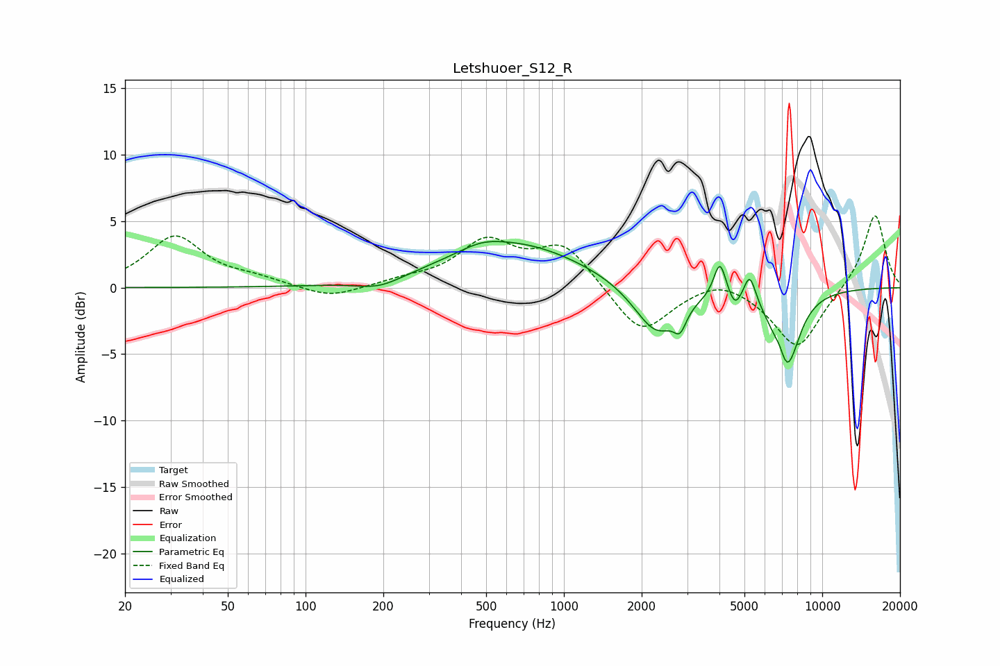

# Letshuoer_S12_R
See [usage instructions](https://github.com/jaakkopasanen/AutoEq#usage) for more options and info.

### Parametric EQs
Apply preamp of -3.6 dB when using parametric equalizer.

|   # | Type    |   Fc (Hz) |    Q |   Gain (dB) |
|-----|---------|-----------|------|-------------|
|   1 | Peaking |       193 | 1.55 |        -0.8 |
|   2 | Peaking |       479 | 1.76 |         0.5 |
|   3 | Peaking |       648 | 0.53 |         3.3 |
|   4 | Peaking |      2280 | 1.62 |        -3.8 |
|   5 | Peaking |      2818 | 6    |        -1.4 |
|   6 | Peaking |      4017 | 6    |         2.7 |
|   7 | Peaking |      4598 | 6    |        -1.1 |
|   8 | Peaking |      5243 | 6    |         2.2 |
|   9 | Peaking |      6884 | 6    |         1.2 |
|  10 | Peaking |      7228 | 2.66 |        -6.4 |

### Fixed Band EQs
When using fixed band (also called graphic) equalizer, apply preamp of **-5.5 dB** (if available) and set gains manually with these parameters.

|   # | Type    |   Fc (Hz) |    Q |   Gain (dB) |
|-----|---------|-----------|------|-------------|
|   1 | Peaking |        31 | 1.41 |         3.8 |
|   2 | Peaking |        62 | 1.41 |         0.5 |
|   3 | Peaking |       125 | 1.41 |        -0.9 |
|   4 | Peaking |       250 | 1.41 |         0.4 |
|   5 | Peaking |       500 | 1.41 |         3.3 |
|   6 | Peaking |      1000 | 1.41 |         3.1 |
|   7 | Peaking |      2000 | 1.41 |        -3.6 |
|   8 | Peaking |      4000 | 1.41 |         1   |
|   9 | Peaking |      8000 | 1.41 |        -4.6 |
|  10 | Peaking |     16000 | 1.41 |         5.7 |

### Graphs

