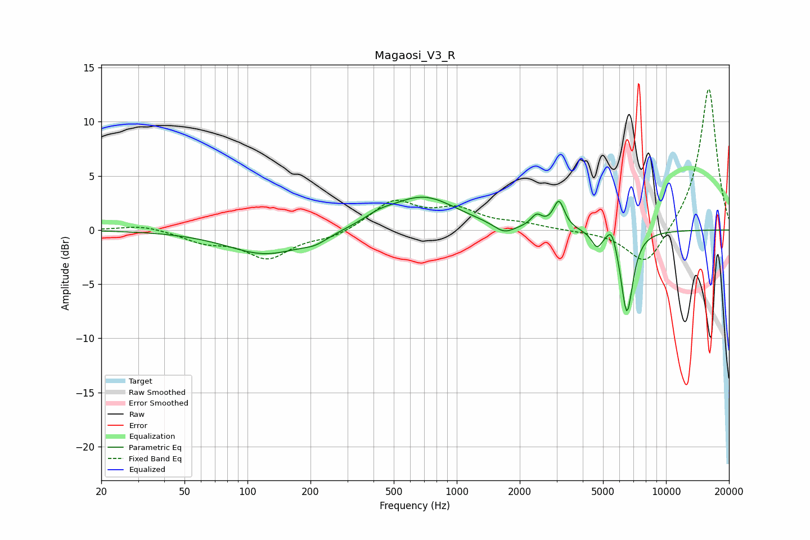

# Magaosi_V3_R
See [usage instructions](https://github.com/jaakkopasanen/AutoEq#usage) for more options and info.

### Parametric EQs
Apply preamp of -3.1 dB when using parametric equalizer.

|   # | Type    |   Fc (Hz) |    Q |   Gain (dB) |
|-----|---------|-----------|------|-------------|
|   1 | Peaking |       123 | 0.77 |        -2.3 |
|   2 | Peaking |       210 | 2.34 |        -0.6 |
|   3 | Peaking |       424 | 1.96 |         0.6 |
|   4 | Peaking |       690 | 0.88 |         3.1 |
|   5 | Peaking |      1684 | 2.86 |        -0.9 |
|   6 | Peaking |      2407 | 5.24 |         1.1 |
|   7 | Peaking |      3078 | 5.38 |         2.5 |
|   8 | Peaking |      4677 | 5.65 |        -1.4 |
|   9 | Peaking |      5500 | 6    |         1.5 |
|  10 | Peaking |      6502 | 4.71 |        -7.7 |

### Fixed Band EQs
When using fixed band (also called graphic) equalizer, apply preamp of **-13.1 dB** (if available) and set gains manually with these parameters.

|   # | Type    |   Fc (Hz) |    Q |   Gain (dB) |
|-----|---------|-----------|------|-------------|
|   1 | Peaking |        31 | 1.41 |         0.5 |
|   2 | Peaking |        62 | 1.41 |        -1   |
|   3 | Peaking |       125 | 1.41 |        -2.5 |
|   4 | Peaking |       250 | 1.41 |        -0.7 |
|   5 | Peaking |       500 | 1.41 |         2.6 |
|   6 | Peaking |      1000 | 1.41 |         1.7 |
|   7 | Peaking |      2000 | 1.41 |         0.5 |
|   8 | Peaking |      4000 | 1.41 |        -0.1 |
|   9 | Peaking |      8000 | 1.41 |        -3.6 |
|  10 | Peaking |     16000 | 1.41 |        13.3 |

### Graphs

