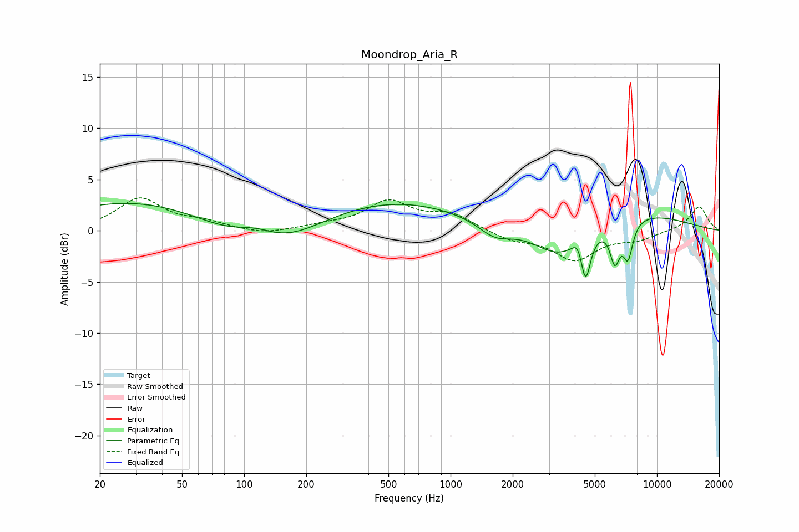

# Moondrop_Aria_R
See [usage instructions](https://github.com/jaakkopasanen/AutoEq#usage) for more options and info.

### Parametric EQs
Apply preamp of -2.8 dB when using parametric equalizer.

|   # | Type    |   Fc (Hz) |    Q |   Gain (dB) |
|-----|---------|-----------|------|-------------|
|   1 | Peaking |       115 | 1.2  |         2.2 |
|   2 | Peaking |       124 | 0.34 |       -15   |
|   3 | Peaking |       124 | 0.18 |        13   |
|   4 | Peaking |      1640 | 1.73 |        -1.5 |
|   5 | Peaking |      3324 | 1.17 |        -2.9 |
|   6 | Peaking |      4144 | 6    |         1.2 |
|   7 | Peaking |      4511 | 5.92 |        -4.3 |
|   8 | Peaking |      6257 | 5.68 |        -3.6 |
|   9 | Peaking |      7240 | 5.67 |        -3.5 |
|  10 | Peaking |      7741 | 0.51 |         1.8 |

### Fixed Band EQs
When using fixed band (also called graphic) equalizer, apply preamp of **-3.3 dB** (if available) and set gains manually with these parameters.

|   # | Type    |   Fc (Hz) |    Q |   Gain (dB) |
|-----|---------|-----------|------|-------------|
|   1 | Peaking |        31 | 1.41 |         3.1 |
|   2 | Peaking |        62 | 1.41 |         0.7 |
|   3 | Peaking |       125 | 1.41 |        -0.4 |
|   4 | Peaking |       250 | 1.41 |         0.4 |
|   5 | Peaking |       500 | 1.41 |         2.7 |
|   6 | Peaking |      1000 | 1.41 |         1.5 |
|   7 | Peaking |      2000 | 1.41 |        -0.9 |
|   8 | Peaking |      4000 | 1.41 |        -2.8 |
|   9 | Peaking |      8000 | 1.41 |        -0.8 |
|  10 | Peaking |     16000 | 1.41 |         2.4 |

### Graphs

