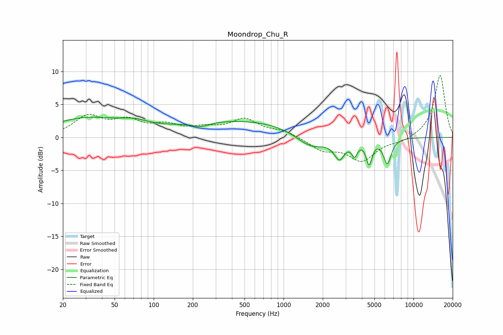

# Moondrop_Chu_R
See [usage instructions](https://github.com/jaakkopasanen/AutoEq#usage) for more options and info.

### Parametric EQs
Apply preamp of -3.2 dB when using parametric equalizer.

|   # | Type    |   Fc (Hz) |    Q |   Gain (dB) |
|-----|---------|-----------|------|-------------|
|   1 | Peaking |        31 | 0.5  |         2.8 |
|   2 | Peaking |        71 | 1.36 |         0.8 |
|   3 | Peaking |       231 | 2.1  |        -0.7 |
|   4 | Peaking |       498 | 0.26 |         2.6 |
|   5 | Peaking |      1622 | 1.16 |        -2.6 |
|   6 | Peaking |      2622 | 4.96 |         1.2 |
|   7 | Peaking |      2660 | 3.75 |        -4.2 |
|   8 | Peaking |      3515 | 6    |        -2.1 |
|   9 | Peaking |      4550 | 6    |        -3.6 |
|  10 | Peaking |      6286 | 4.57 |        -3.8 |

### Fixed Band EQs
When using fixed band (also called graphic) equalizer, apply preamp of **-9.5 dB** (if available) and set gains manually with these parameters.

|   # | Type    |   Fc (Hz) |    Q |   Gain (dB) |
|-----|---------|-----------|------|-------------|
|   1 | Peaking |        31 | 1.41 |         3   |
|   2 | Peaking |        62 | 1.41 |         2.2 |
|   3 | Peaking |       125 | 1.41 |         1.5 |
|   4 | Peaking |       250 | 1.41 |         1.1 |
|   5 | Peaking |       500 | 1.41 |         2.5 |
|   6 | Peaking |      1000 | 1.41 |         0.9 |
|   7 | Peaking |      2000 | 1.41 |        -1.8 |
|   8 | Peaking |      4000 | 1.41 |        -3.4 |
|   9 | Peaking |      8000 | 1.41 |        -0.6 |
|  10 | Peaking |     16000 | 1.41 |         9.5 |

### Graphs

